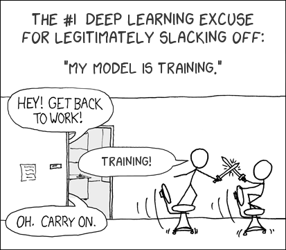

### WHAT
Are you interested in life science, data analytics and/or computing? Then this workshop is for you! This workshop will introduce you to the growing field of Bioinformatics and its applications. We will discuss bioinformatics approaches to analyze Bacteriophage samples and you will get the chance to run your own analysis.

### WHERE
This is an in-person workshop and will be held on the College of Southern Nevada’s (CSN) campus. 

### WHO
The workshop’s intended audience are undergraduate students, but everyone interested in Bioinformatics and Bacteriophage research is welcome to participate. 

### WHEN - **Friday, March 24, 2023**

 
<table class="tg">
<thead>
  <tr>
    <th>Module</th>
    <th>Time</th>
  </tr>
</thead>
<tbody>
  <tr>
    <td>Introductory Lecture: Bioinformatics and Bacteriophages</td>
    <td>9:00am – 9:50am</td>
  </tr>
  <tr>
    <td>Hands-on Training:  Analysis of a Bacteriophage Dataset</td>
    <td>10:00am – 12:45pm</td>
  </tr>
    <tr>
    <td>Nevada INBRE supported Lunch</td>
    <td>1:00pm – 2:00pm</td>
  </tr>
    <tr>
    <td>Nevada INBRE Data Science Core Open Office Hours</td>
    <td>2:00pm– 4:30pm</td>
  </tr>
</tbody>
</table>
 

### INTERESTED 
Space is limited and confirmation of participation will be required. Registration is due by **March 10th, 2023**. You can join us for any or all sessions. 

<a href="https://nvideaoffice.formstack.com/forms/csn_phagegenomics">Click HERE to register</a> 

 
Questions?? Reach out at any time, email nbc_training@unr.edu or call (775) 784-4359.

### PRESENTERS
Hans Vasquez-Gross, PhD and Juli Petereit, PhD from the Nevada Bioinformatics Center and Nevada INBRE Data Science Core will be supporting this research event. 

### ACKNOWLEGEDMENT
We thank <a href="https://www.linkedin.com/in/jaiden-christopher-0568aa1ba/">Jaiden Christopher</a> for the beautiful graphics.  

This event is made possible by grants from the National Science Foundation (2001385, 2019609) with additional support from a grant by the National Institute of General Medical Sciences (GM103440) from the National Institutes of Health. 

 

<!--  -->

<!-- To tackle these types of problems, we can use supervised learning - the branch of Artificial Intelligence that uses labeled data to train algorithms for a particular task! -->

<!-- <a href="https://med.unr.edu/inbre">Nevada INBRE</a> and the <a href="https://www.unr.edu/bioinformatics">Nevada Bioinformatics Center</a> are pleased to announce the upcoming Python for Supervised Machine Learning Bootcamp. Through hands-on learning activities, we will cover  -->

<!--  - Module 1: Basics of Python for Data Science  -->
<!--  - Module 2: Fundamentals of Machine Learning for Classification and Regression  -->

<!-- You will come out of the bootcamp understanding how to wrangle data, build and train both simple and sophisticated models, and evaluate your models in the context of different use cases.  -->

<!-- ## Bootcamp Overview -->

<!-- ### Module I: Python Crash Course -->
<!--  Python is a high-level, general-purpose, and open source programming language. It is emerging as one of the most popular programming languages, both for scientific computing and general use. In the python crash course, we will cover an overview of python and programming fundamentals, and then describe how to use python for data processing, analysis, and visualization. At the end of this module, you will be able to: -->

<!-- - Write and debug basic python code -->
<!-- - Use functions, loops, conditional statements, and more advanced data structures to build higher level programs -->
<!-- - Analyze a dataset using python libraries built for data science -->
<!-- - Process your data for downstream applications, such as machine learning -->

<!-- ### Module II: Fundamentals of Supervised Machine Learning -->
<!-- Supervised machine learning - the genre of machine learning that learns from past measurements or signals to make predictions on new data - has applications in nearly every field, from biology to art, astronomy to history. In this second part of the course, we will cover the fundamentals of supervised machine learning, working through the intuition behind supervised machine learning models and doing hands-on model development. At the end of this module you, you will be able to: -->

<!-- - Describe the intuition and concepts behind supervised machine learning, from both a high-level overview, and from a technical perspective -->
<!-- - Build, train, and test classification and regression models using python’s machine learning libraries -->
<!-- - Diagnose, tune, and refine your models in order to improve performance -->
<!-- - Identify the use cases and limitations of various machine learning models and datasets -->

<!-- ## Things to Know -->

<!-- ### Audience and Prerequisites -->

<!-- **Everyone** is welcome to apply. No prior knowledge of coding or machine learning are necessary! This bootcamp is intended for novice scientists wanting to become familiar with Python and ML concepts enabling them to applied these methods to their own research endeavors.  -->

<!-- For researchers looking for more advance help in Machine Learning, please send a request to <nbc_training@unr.edu>. -->

<!-- ### Application and Registration Fee -->

<!-- Spots are limited. Application for participation will be due **January 6th, 2023**, apply asap to reserve your spot. Late application may be considered if open seats remain.  -->

<!-- <table class="tg"> -->
<!-- <thead> -->
<!--   <tr> -->
<!--     <th>Module</th> -->
<!--     <th>Date and Time</th> -->
<!--     <th>Registration Fee</th> -->
<!--   </tr> -->
<!-- </thead> -->
<!-- <tbody> -->
<!--   <tr> -->
<!--     <td>Python Crash Course with Introduction to Data Science</td> -->
<!--     <td>January 12 & 13, 2023, 10am - noon, 1 - 4pm</td> -->
<!--     <td>$100</td> -->
<!--   </tr> -->
<!--   <tr> -->
<!--     <td>Fundamentals of Supervised Machine Learning</td> -->
<!--     <td>January 19 & 20, 2023, 10am - noon, 1 - 4pm </td> -->
<!--     <td>$100</td> -->
<!--   </tr> -->
<!-- </tbody> -->
<!-- </table> -->

<!-- **Priority will be given to registrations for both modules, but we also welcome registrations for individual modules.** -->
<!-- **noon - 1pm: lunch on your own.** -->

<!-- **Limited Registration Waivers are available, everyone is welcome to apply!** -->

<!-- **For Students and Postdocs**, application requires: -->

<!-- - Complete online application form -->
<!-- - Indicate 1 academic reference, and provide their contact information in the application form. The application will automatically send them a link to the brief reference form to fill out. All references need to be submitted directly by the author. Your references will not receive the link to the reference form until your application is fully submitted. Please be sure to allow enough time for your references to complete the form by January 9, 2023. -->

<!-- If you are interested in applying for a **Registration Waiver** addition materials are required:  -->

<!-- - Copy of unofficial transcript (not for postdocs) -->
<!-- - Personal statements not to exceed one page should address the following  -->
<!--   - Academic background and research interests -->
<!--   - Why you are interested in this bootcamp and what you hope to gained from this training -->
<!--   - How will this training affect your academic/research/professional career -->
<!--   - Anything else you want to share -->

<!-- <a href="https://nvideaoffice.formstack.com/forms/pythonmachinelearningbootcamp">Click here to be taken to the application form</a> -->

<!-- **Faculty application** requires: -->

<!-- - Complete online application form -->
<!-- - Limited **Registration Waivers** are available, must indicate why one cannot self-support their attendance   -->

<!-- <a href="https://nvideaoffice.formstack.com/forms/pythonmachinelearningbootcamp_fac">Click here to be taken to the faculty application form</a> -->

<!-- Application is open until **January 6, 2023**. Completed applications will be reviewed weekly until the closing date and applicants will be notified.  -->

<!-- ### Additional Information -->

<!-- Coordinator: Juli Petereit, <jpetereit@unr.edu>  -->

<!-- Instructor:  Brianna Sierra Chrisman -->

<!-- Important:  -->

<!-- - Student applications will receive priority -->
<!-- - Attendance is required in-person -->
<!-- - No-show policy: the associated lab/PI will be charged the registration fee even when a waiver was granted. In other words, if you don't intend to actually be there, don't register and take a spot from another student  -->
<!-- - Certificate of Completion will be provided when attending both modules -->

<!-- ## Acknowledgements -->

<!-- This bootcamp is partially supported by a grant from the National Institute of General Medical Sciences (GM103440) from the National Institutes of Health. -->

<!-- Comics thanks to https://xkcd.com/.  -->

