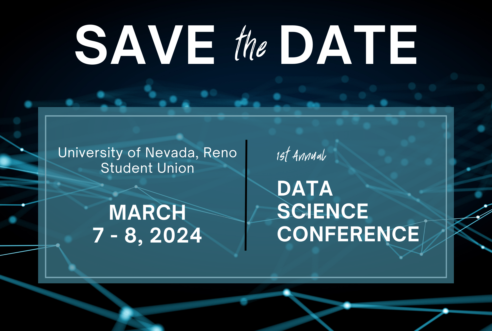
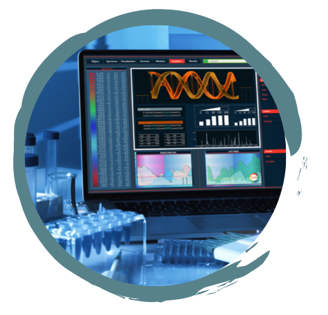
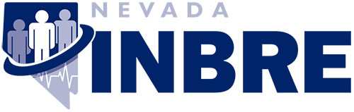

 

Mark your calendars! We are excited to host the 1st Annual Data Science Conference on March 7 and 8, 2024. **This event will bring together leading experts, researchers, and students to grow data science knowledge and skills on our campus.** Our conference will feature keynote speakers, panel discussions, interactive workshops, and networking opportunities that you don’t want to miss.

 

### **Partnership and Sponsorship**

We invite you to join us as a sponsor for our upcoming campus-wide Data Science Conference, where we are passionate about promoting diversity in the field of data science. 

This event will bring together a diverse and talented group of students, faculty, professionals, and experts to celebrate the rich tapestry of perspectives and ideas that make data science thrive. By supporting our conference, you can be an integral part of this movement towards inclusivity and innovation. 

Our sponsorship opportunities range from basic to premium, allowing you to choose a level that aligns with your objectives and budget. Whether you're looking to increase brand visibility, engage with a diverse talent pool, or demonstrate your commitment to fostering diversity in the tech world, we have sponsorship options that will help you achieve your goals. Join us in making a meaningful impact, enhancing diversity, and driving the future of data science. 

***Together, we can make a difference!***

Various levels of sponsorship are available. If you are interested in sponsoring the conference, contact DataScienceInitiative@unr.edu.

<table class="tg">
<thead>
  <tr>
    <th>What's included</th>
    <th>Bronze
$250</th>
    <th>Silver
$1,000</th>
    <th>Gold
$2,000</th>
    <th>Platinum
$3,000</th>    
    <th>Diamond
$4,000</th>
    <th>Titanium
$6,000</th>  
  </tr>
</thead>
<tbody> 
  <tr>
    <td>Availability
    <td>10
    <td>10
    <td>5
    <td>4
    <td>3
    <td>1
  </tr>
  <tr>
    <td>
    <td>
    <td>
    <td>
    <td>
    <td>
    <td>
  </tr>
  <tr>
    <td>Exhibit booth to showcase products.
    <td>x
    <td>x
    <td>x
    <td>x
    <td>x
    <td>x
  </tr>
  <tr>
    <td>Logo on the website.
    <td>
    <td>x
    <td>x
    <td>x
    <td>x
    <td>x
  </tr>
  <tr>
    <td>Mention in opening remarks.
    <td>
    <td>x
    <td>x
    <td>x
    <td>x
    <td>x
  </tr>
  <tr>
    <td>Social media shout-outs.
    <td>
    <td>x
    <td>x
    <td>x
    <td>x
    <td>x
  </tr>  
  <tr>
    <td>Enhanced logo placement on conference materials as well as display of logo at the event at the door.
    <td>
    <td>
    <td>x
    <td>x
    <td>x
    <td>x
  </tr>
  <tr>
    <td>Dedicated exhibit booth location
    <td>
    <td>
    <td>x
    <td>x
    <td>x
    <td>x
  </tr>
  <tr>
    <td>Recognition in conference email and marketing material.
    <td>
    <td>
    <td>x
    <td>x
    <td>x
    <td>x
  </tr>
  <tr>
    <td>Prime logo placement on conference materials.
    <td>
    <td>
    <td>
    <td>x
    <td>x
    <td>x
  </tr>
  <tr>
  <td>Opportunity to host a workshop or panel discussion.
    <td>
    <td>
    <td>
    <td>x
    <td>x
    <td>x
  </tr>
  <tr>
    <td>Exclusive sponsorship of a high-visibility conference element (e.g., networking reception, coffee break) and 5min talking slot.
    <td>
    <td>
    <td>
    <td>x
    <td>
    <td>
  </tr>
  <tr>
    <td>Exclusive sponsorship of a conference keynote speaker and 10min talking slot.
    <td>
    <td>
    <td>
    <td>
    <td>x
    <td>
  </tr>
  <tr>
    <td>Special acknowledgement mention and 15min talking slot.
    <td>
    <td>
    <td>
    <td>
    <td>
    <td>x
  </tr>
  <tr>
  <td>Exclusive sponsorship of Seed Funding for a Collaborative Data Science Project; for Faculty.
    <td>
    <td>
    <td>
    <td>
    <td>
    <td>x
  </tr>
</tbody>
</table>
 

<!-- [Flyer](research_day_pdf.html) -->

<!-- Have you been interested in R programming, but don't know how to get started   -->
<!-- You have heard about Data Science and would like to know more  -->
<!-- Or are interested in Microbiome research   -->

<!-- 
... then come join us and be part of **Nevada INBRE's Research Day at NSC** 
  -->

<!-- The the morning, you will be introduced to the <a href="https://www.r-project.org/">R programming language</a> and get you started with <a href="https://posit.co/downloads/">Posit, formerly known as RStudio</a> while learning a little about Data Science. We will then have an INBRE supported lunch, followed by an introduction to microbial community analysis using R.  -->

<!-- ## Research Day Overview -->

<!-- ### Introductory to R Programming -->

<!--  In this training you will be introduced to the R programming language and Posit, formerly known as RStudio to analyze your data. We will teach you how to read and write data, manipulate it, and create publication-ready graphs. -->

<!-- **No prior programming experience is required.**   -->

<!-- ### Nevada INBRE Lunch -->

<!--  Come join us for an informal lunch to learn more about Data Science, Bioinformatics, and Microbiome Research, the INBRE program and how you can take advantage, or if you just want to chat about the world.  -->
<!--   -->
<!--   -->
<!--   -->

<!-- ### Microbiome Analysis -->

<!--  Here we will show you how to analyze microbiome data using the DADA2 pipeline, starting with sequencing data and showing you how to define Amplicon Sequence Variants (ASVs), assign taxonomy, and perform basic microbiome analysis.  -->

<!-- **Some R knowlege is required, aka come join us in the morning session.**  -->
<!--   -->
<!--   -->

<!-- ## Things to Know -->

<!-- ### Where -->
<!-- This is an in-person event and will be held on the Nevada State College’s (NSC) campus.  -->
<!--   -->

<!-- ### Who -->
<!-- The workshop’s intended audience are undergraduate students, but everyone interested in R and/or microbiome research is welcome to participate - but registration is required, keep on reading.  -->
<!--   -->

<!-- ### When - **Friday, March 10, 2023** -->

<!--   -->
<!-- <table class="tg"> -->
<!-- <thead> -->
<!--   <tr> -->
<!--     <th>Module</th> -->
<!--     <th>Time</th> -->
<!--   </tr> -->
<!-- </thead> -->
<!-- <tbody> -->
<!--   <tr> -->
<!--     <td>Hands-on Training: Introductory R</td> -->
<!--     <td>8:00am – 11:30am</td> -->
<!--   </tr> -->
<!--     <tr> -->
<!--     <td>How to Apply to Grad/Med School presented *by Mrs. Martinez-Anderson, Director of Admissions UNR Med*</td> -->
<!--     <td>11:30pm – 12:00pm</td> -->
<!--   </tr> -->
<!--     <tr> -->
<!--     <td>Nevada INBRE supported Lunch</td> -->
<!--     <td>12:00pm – 1:00pm</td> -->
<!--   </tr> -->
<!--     <tr> -->
<!--     <td>Hands-on Training: Microbiome Analysis</td> -->
<!--     <td>1:15pm – 4:00pm</td> -->
<!--   </tr> -->
<!--   <tr> -->
<!--     <td>Ask Me Anything, we will sick around if there are questions</td> -->
<!--     <td>4:00pm – 5:00pm</td> -->
<!--   </tr> -->
<!-- </tbody> -->
<!-- </table> -->
<!--    -->

<!-- ### Interested -->
<!-- Space is limited and confirmation of participation will be required. Registration is due by **March 1st, 2023**. You can join us for any or all sessions.  -->

<!-- 
<a href="https://nvideaoffice.formstack.com/forms/nsc_researchday">Click HERE to register</a> 
 -->

<!--   -->
<!-- Questions?? Reach out at any time, email nbc_training@unr.edu or call (775) 784-4359. -->

<!-- ### Presenters -->
<!-- Nicole Schrad, PhD and Juli Petereit, PhD from the Nevada Bioinformatics Center and Nevada INBRE Data Science Core will be supporting this research event.  -->

<!-- ### Acknowlegement -->
<!-- This event is made possible by a grant from the National Institute of General Medical Sciences (GM103440) from the National Institutes of Health.  -->

<!--   -->
