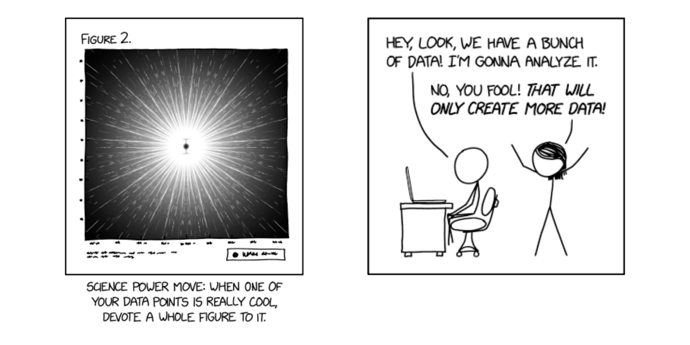

```{=html}
<style><!--Page specific style-->
  h1 {color: #000}
  h2 {color: #111}
  h3 {color: #222; border-bottom: 1px solid #ccc; width: 75%;}
  h4 {color: #666}
  .top {color: #ccc; display: inline-block; padding: 25px 0px 5px 0px;}
</style>
```


## We will soon add more information about the Data Science Initiative. In the meantime, here some funny comics!


<center>

Comics thanks to <https://xkcd.com/>.
</center></p>

---

## **Exciting Announcement: Launch of New Data Science Initiative at the University of Nevada, Reno**

We are thrilled to announce the inception of a Data Science Initiative on our campus, led by a Nevada INBRE supplemental award and supported by Research & Innovation. This initiative aims to transform the landscape of data science at our institution, contribute to cutting-edge research and innovation, open new academic paths, and break silos across colleges, schools, and departments.

## Participate in Our Campus-wide Data Science Survey!

To shape this initiative effectively, we invite all members of our campus community to participate in a 10-15 min survey. Your insights and feedback are invaluable. By sharing your thoughts, you will play a vital role in shaping the future of our program. [Click here to access the survey](https://unr.az1.qualtrics.com/jfe/form/SV_2cux0Tr4nJO9iS2). Submit your responses by Nov. 27, 2023 for a chance to be one of the lucky 50 participants who will win a $10 Starbucks gift card!

## Data Science Conference: March 7 & 8, 2024
 
Mark your calendars! We are excited to host a Data Science Conference on March 7 and 8, 2024. This event will bring together leading experts, researchers, and students. Our conference will feature keynote speakers, interactive workshops, and networking opportunities that you don't want to miss.

## Undergraduate Student Travel Grants Available
 
In addition to our campus conference, we are pleased to announce that we will be offering student travel grants to attend Data Science Conferences nationwide. This initiative aims to support the growth and development of budding data scientists within the community. [Click here](https://nvideaoffice.formstack.com/forms/dsi_travelawardapplication) to apply for these grants.
 
## Stay Informed – Join Our Mailing List
 
To receive the latest updates and information about our Data Science Initiative, the upcoming Data Science Conference, student travel grants, and workshops be sure to [join our mailing list](https://lists.unr.edu/mailman3/postorius/lists/datascience.lists.unr.edu/). Stay tuned for exciting news and developments.

## Get Involved and Reach Out!
 
We encourage everyone who is enthusiastic about data science or has questions about the initiative to get involved. If you have ideas, want to collaborate, or simply seek more information, don't hesitate to reach out to us. We are here to help and welcome your active participation in shaping the future of data science on our campus. Feel free to contact us at DataScienceInitiative@unr.edu for any inquiries or to express your interest in contributing to this exciting initiative. Together, we can unlock the immense potential of data science and make a lasting impact. 


Your support and input are instrumental to the success of this Data Science Initiative, and we look forward to your continued collaboration. 

Please feel free to reach out if you have any questions, suggestions, or want to get more involved at DataScienceInitiative@unr.edu. 

Don't miss this opportunity to be at the forefront of data science at our institution. Together, we will drive innovation and advance the field of data science. Thank you for your participation and support!


<!-- ## Acknowledgements -->

<!-- Comics thanks to <https://xkcd.com/>. -->
