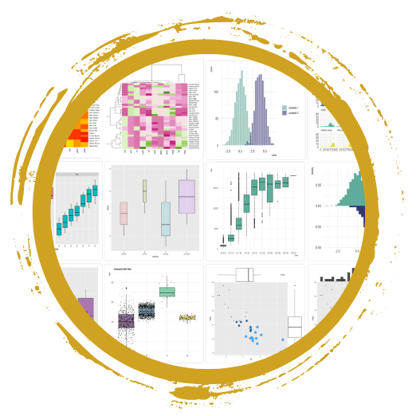
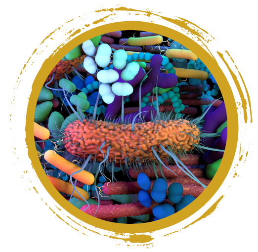

<!-- [Flyer](research_day_pdf.html) -->

GitHub ... yes I need to create that account  
R programming ... but I don't know where to get started  
Microbiome research ... that sounds interesting  

Sounds familiar, then come join us for

 **Data Science for Research: Essential Skills, Tools, and Hands-On Techniques at NSU**
 

Join us for a series of hands-on workshops designed to provide essential skills for data science and bioinformatics research. Whether you're just starting your journey or looking to expand your skill set, these sessions offer practical, beginner-friendly training with a focus on collaboration, analysis, and visualization. These workshops are ideal for researchers, students, and professionals interested in data science, bioinformatics, or related fields.
 
Come join us for one or all training events. 

**Registration Information:**
Please register for each workshop individually through the provided registration link. 

Space is limited, register early to secure your spot. Registration will remain open until slots are filled. 

<a href="https://nvideaoffice.formstack.com/forms/nsu_training">**Click HERE to register**</a> 

 

The workshop series will take place at **Nevada State University, KAB 127**. This room is a computer lab, but you are welcome to bring your own laptop. 

##  Overview

### Introduction to Version Control and GitHub

 **Prerequisites:** None  
 

Whether you're new to version control or looking to improve your project management skills, this interactive workshop will guide you through the fundamentals of GitHub. Learn how to leverage this powerful tool for both collaboration and personal use, setting you up for success in managing and tracking code and data.

In this workshop, you will learn how to:

- Set up and navigate GitHub
- Create and manage repositories for academic projects
- Collaborate on shared repositories

By the end of this session, you will have the skills to confidently use GitHub for version control and collaborative projects. 

 

### Kickstart Your Journey with R

 **Prerequisites:** R and RStudio installed on your computer  
  

This general hands-on workshop is ideal for researchers or students with no prior coding experience but an interest in data analysis looking to get started with <a href="https://www.r-project.org/">R programming language</a> and <a href="https://posit.co/downloads/">Posit, formerly known as RStudio</a> Designed for those with little to no coding experience, you’ll gain the foundation skills needed to import, investigate, and visualize data in R. 

Topics covered will include:

- **Setting up R and RStudio:** Navigating the interface and installing libraries/packages
- **Data handling:** Importing, exploring, and exporting datasets
- **Descriptive statistics:** Generating summary statistics to understand your data
- **Visualization:** Creating beginner-friendly plots to represent your data

**Bonus:** Do you have your own dataset and a question/task in mind? – Send your dataset and question to nbc_training@unr.edu by March 18th and we’ll do our best to integrate it into the training session. 

By the end of this session, you will be able to confidently use R for basic data analysis and visualization.

 

### Lunch

Join us for an informal lunch where you can meet bioinformaticians and data scientists, learn about NSU’s INBRE programs, and explore research opportunities. It’s a great chance to connect, network, and chat about exciting opportunities in a relaxed setting. 

 

### Visualization of 16S Microbial Data with R

**Prerequisites:** Basic experience with R. (If you’re new to R, please attend the Kickstart Your Journey with R workshop in the morning.)

In this specialized workshop, you will learn how to analyze and visualize 16S rRNA microbial data using R. With a focus on microbial research, you’ll gain hands-on experience working with real data from NSU researchers. This session is designed to help you understand how to manage and visualize microbial community data effectively.

We will talk about how the raw sequencing data (FASTQ files) are handled to generate an Amplicon Sequence Variant (ASV) table. ASVs is a high-resolution method for microbial community analysis as an alternative to Operational Taxonomic Units (OTUs).

During the hands-on session, you'll focus on three key areas: 

- **Quality Control Measures:** Learn to evaluate the quality of microbial data using tools like rarefaction curves and Principal Coordinates Analysis (PCoA) plots
- **Taxonomic Diversity Analysis:** Explore the diversity of microbial taxa by examining their classifications (kingdom, phylum, class, order, family, genus, species) across different samples and conditions. Techniques include alpha-diversity analysis and creating visualizations like stacked bar plots
- **Statistical Testing:** Conduct statistical analyses to identify microbial taxa that significantly differ between conditions

By the end of this workshop, you’ll be equipped to visualize, analyze, and present microbial data in a meaningful way, but you can also take these transferable skills and apply them to other projects. 

 

## Things to Know

### Where

This is an in-person event and will be held at **Nevada State University**, Kasner Academic Building - room 127.
 

### Who
The workshop’s intended audience are undergraduate students, but everyone interested in **GitHub, R and/or microbiome research** is welcome to participate - but registration is required. 
 

### When

Friday, coffee will be available in the morning and lunch will be provided for registered participants.

<table class="tg">
<thead>
  <tr>
    <th>Module</th>
    <th>Date</th>
    <th>Time</th>
  </tr>
</thead>
<tbody>
  <tr>
    <td>An Introduction to Version Control and GitHub</td>
    <td>Thursday, March 27, 2025</td>    
    <td>1:30 PM - 5:00 PM</td>
  </tr>
  <tr>
    <td>Kickstart Your Journey with R</td>
    <td>Friday, March 28, 2025</td> 
    <td>8:15 AM - 11:45 AM</td>
  </tr>
    <tr>
    <td>Lunch</td>
    <td>Friday, March 28, 2025</td> 
    <td>11:45 AM - 12:45 PM</td>
  </tr>
    <tr>
    <td>Visualization of 16S Microbial Data with R</td>
    <td>Friday, March 28, 2025</td>
    <td>12:45 PM - 4:15 PM</td>
  </tr>
</tbody>
</table>
  

### Questions?? 

We look forward to seeing you at the workshop series! For inquiries, please contact the Nevada Bioinformatics Center at nbc_training@unr.edu and Dr. Aster Sigel at Aster.Sigel@nevadastate.edu. Detailed instructions for preparation will be sent to registered participants ahead of the sessions.

### Presenters
Cassandra Hui, PhD and Juli Petereit, PhD from the Nevada Bioinformatics Center and Nevada INBRE Data Science Core will be supporting these training events in collaboration with Dr. Aster Sigel - NV INBRE Undergraduate Research Program Director at NSU. 

### Acknowlegement
These training events and lunch are hosted by the Nevada Bioinformatics Center and the Nevada INBRE Data Science Core, and supported by grants from the National Institute of General Medical Sciences (GM103440) and the National Science Foundation (2203236).

 
