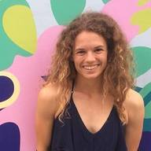

Nevada INBRE, part of the [IDeA Network of Biomedical Research Excellence](https://www.nigms.nih.gov/Research/DRCB/IDeA/Pages/INBRE.aspx), is a National Institutes of Health (NIH) program designed to help traditionally underfunded states build biomedical infrastructure. Nevada INBRE also works with [NSHE partner institutions](https://med.unr.edu/inbre/about-us/partner-institutions) to promote [biomedical research knowledge and educational opportunities](https://med.unr.edu/inbre/programs-and-projects) across the state of Nevada via biomedical and science pipeline programs.

---

## People

<!--contains person blocks (fixes formatting)-->

### Juli Petereit --- Co-Director

Juli is a bioinformatics, data, or computational scientist, depending on who you ask. She supports researchers at the University of Nevada, Reno and of the Mountain West IDeA Clinical and Translational Research-Infrastructure Network (CTR-IN) by providing state-of-the-art bioinformatics and (bio)statistics services for individual research projects. She is an expert in small- and large-scale statistical and quantitative analyses, statistical inference, complex network modeling, analysis of high-throughput omics data, and other advanced bioinformatics and biostatistical applications. She serves an interdisciplinary research community and is involved in numerous research projects ranging from survey studies in social behavioral science to studies examining protein levels across multiple experimental conditions and time points. She runs the Nevada Bioinformatics Center at the University of Nevada, Reno and is the Associate Director of the Mountain West CTR-IN Biostatistics, Epidemiology, Research and Design (BERD) core.

### Edwin Oh --- Co-director

The primary questions that drive Ed's research program are 1) what are the genetic and structural variants that contribute to human health and disease, 2) how do we interpret such variation to improve the cellular and molecular diagnosis of genetic diseases, and 3) how do we enable the development of therapeutic paradigms. To address these questions, Ed utilizes a variety of molecular and genomic technologies and animal modeling systems that include next-gen sequencing platforms and mouse and zebrafish mutant models. A significant fraction of the team’s endeavors is facilitated through the dissection of organellar stress in developmental neurological disorders such as, schizophrenia (SZ) and autism-spectrum disorders (ASD). 

### Brianna Chrisman --- Computational Geneticist

Brianna is a recently graduated PhD student from the department of Bioengineering at Stanford University. She works in computational genomics, the intersection of computer science and biology. Brianna’s research focused on using the unmapped read space of next-gen sequencing in order to understand the human genome, virome, and contaminome. Brianna has taught several AI and biological courses, as well as mentored high schoolers, undergraduates, and grad students though computational biology projects. Outside of academics, Brianna loves rock climbing and most anything outdoors.

### Hans Vasquez-Gross --- Bioinformatician

Hans is a bioinformatician with expertise in genomics, transcriptomics, and DNA-seq and RNA-seq technologies. He has worked on a variety of research projects ranging from transcriptome assembly to whole genome assembly using a variety of sequencing technologies such as Illumina, PacBio, and HiC, to name a few. Hans has extensive experience with plant genetics starting from the model organism Arabidopsis, but also ranging to larger, more complex genomes such as Pine trees and Wheat. In previous positions, he has developed web infrastructure to power organism databases, as well as creating web services for CyVerse. He joined the Nevada Bioinformatics Center in January 2021.

### Alex Knudson --- Data Scientist

Alex is a data scientist with a passion for programming. He is a UNR alumnus who received his M.S. in Statistics and Data Science, and joined the Nevada Bioinformatics Center in August 2020 and has been helping on and off ever since. 

<!--end container-->

### Alumni of Nevada INBRE Data Science Core (formerly Bioinformatics) 

- <a href="https://www.linkedin.com/in/lucas-bishop-82a367b3/">Lucas Bishop</a>, Bioinformatician, 2021 - 2022
- <a href="https://www.linkedin.com/in/richard-tillett-34baa954/">Richard Tillett</a>, Bioinformaticics Scientist, 2012 - 2022

