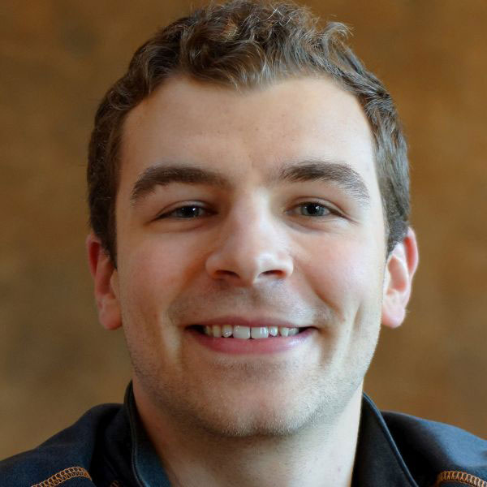

Nevada INBRE, part of the [IDeA Network of Biomedical Research Excellence](https://www.nigms.nih.gov/Research/DRCB/IDeA/Pages/INBRE.aspx), is a National Institutes of Health (NIH) program designed to help traditionally underfunded states build biomedical infrastructure. Nevada INBRE also works with [NSHE partner institutions](https://med.unr.edu/inbre/about-us/partner-institutions) to promote [biomedical research knowledge and educational opportunities](https://med.unr.edu/inbre/programs-and-projects) across the state of Nevada via biomedical and science pipeline programs.

---

## People

<!--contains person blocks (fixes formatting)-->

### Juli Petereit --- Co-director

Juli is a bioinformatics scientist, life science data scientist, or computational scientist, depending on who you ask. She supports researchers at the University of Nevada, Reno and of the Mountain West IDeA Clinical and Translational Research-Infrastructure Network (CTR-IN) by providing state-of-the-art bioinformatics and (bio)statistics services for individual research projects as follows:

- Conducting custom and standardized data analytical protocols (for bioinformatics, biostatistics, and biomedical data science)
- Developing statistical and computational pipelines to ensure reproducible research
- Assisting in pre-proposal support and extramural grant applications

Juli is an expert in small- and large-scale statistical analyses, quantitative analyses, statistical inference, (social/gene) network modeling, analysis of complex statistical data, analysis of large-scale high-throughput omics data, and other advanced bioinformatics and biostatistical applications. She serves an interdisciplinary research community and is involved in numerous research projects ranging from survey studies in social behavioral science to studies examining protein levels across multiple experimental conditions. She is also an active member of the Mountain West CTR-IN Biostatistics, Epidemiology, Research and Design (BERD) core, which provides comprehensive support for study design, biostatistics, and data management. Juli has been with the Nevada Bioinformatics Center since March 2017.

### Edwin Oh --- Co-director

The primary questions that drive Dr. Oh’s research program are 1) what are the genetic and structural variants that contribute to human health and disease, 2) how do we interpret such variation to improve the cellular and molecular diagnosis of genetic diseases, and 3) how do we enable the development of therapeutic paradigms. To address these questions, Dr. Oh utilizes a variety of molecular and genomic technologies and animal modeling systems that include next generation sequencing platforms and mouse and zebrafish mutant models. A significant fraction of the team’s endeavors is facilitated through the dissection of organellar stress in developmental neurological disorders such as, schizophrenia (SZ) and autism-spectrum disorders (ASD). The team has been awarded new grants and has been focused on characterizing the phenotypic extremes of genetic disorders.

### Hans Vasquez-Gross --- Bioinformatician

Hans is a bioinformatician with expertise in genomics, transcriptomics, and DNA-seq and RNA-seq technologies. He has worked on a variety of research projects ranging from transcriptome assembly to whole genome assembly using a variety of sequencing technologies such as Illumina, PacBio, and HiC, to name a few. Hans has extensive experience with plant genetics starting from the model organism Arabidopsis, but also ranging to larger, more complex genomes such as Pine trees and Wheat. In previous positions, he has developed web infrastructure to power organism databases, as well as creating web services for CyVerse. Hans earned his bachelor’s degree in molecular cell biology from the University of California, Davis, where he also obtained his Ph.D. in integrative genetics and genomics. He joined the Nevada Bioinformatics Center in January 2021 and looks forward to supporting exciting and challenging research endeavors.

### Lucas Bishop --- Bioinformatician

Lucas is a bioinformatician who began his scientific career as a ‘wet lab’ researcher at the Desert Research Institute in Reno and thus can truly relate to the daily troubles of a life-scientist. Lucas most recently was a scientific technician in Dr. Pat Schloss’ microbiome lab creating and analyzing large-scale NGS datasets to help gain an understanding of the role of the gut microbiota in Clostridium difficile infections and the progression of colorectal cancer. As such, Lucas brings unique expertise to the core with specializations in microbial pathway analysis and large-scale genetic ecology, particularly of the microbiome (human, animal, environmental). Lucas is a University of Nevada, Reno alumnus who received his B.S./M.S. in biotechnology and joined the Nevada Bioinformatics Center in February 2021. He looks forward to assisting in many research projects at the University and beyond. He is interested in the development of reproducible bioinformatics pipelines and in the application of machine learning techniques to better diagnose and treat human disease.

### Alex Knudson --- Data Scientist

Alex is a data scientist with a passion for programming. He is a UNR alumnus who received his M.S. in Statistics and Data Science, and joined the Nevada Bioinformatics Center in January 2021.

<!--end container-->
