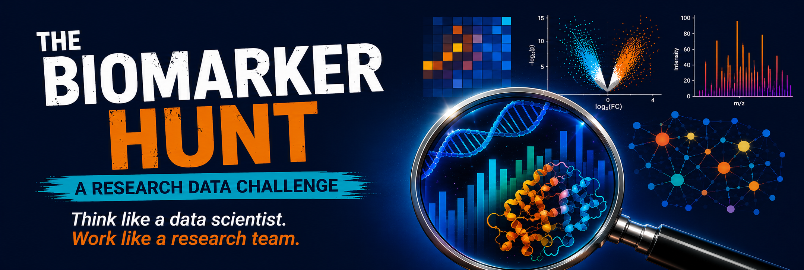
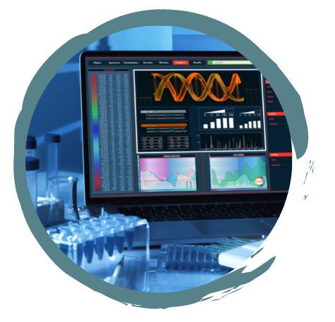
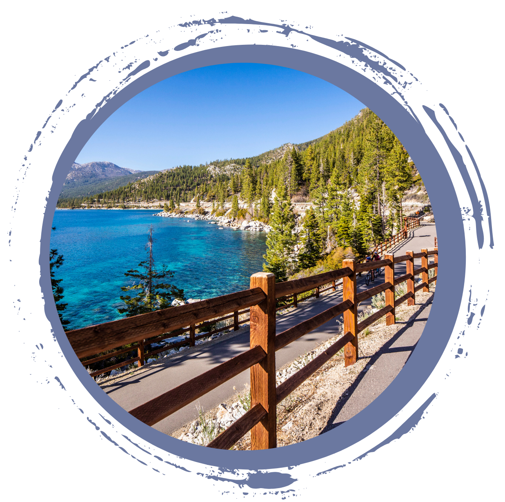

 

**The Biomarker Hunt: A Research Data Challenge** 
*Think like a data scientist. Work like a research team.* 
 
**August 27 - August 30, 2026** 
**University of Nevada, Reno at Lake Tahoe **

  

**The Biomarker Hunt** is a collaborative research data challenge that combines short instructional sessions with hands-on analysis. Working in small teams, participants will analyze authentic transcriptomics (RNA-seq) and proteomics (DIA) datasets to investigate biomedical questions while developing practical data science skills that are broadly applicable across research disciplines.

**Rather than following step-by-step tutorials, participants learn by doing.** Teams explore real-world datasets, ask questions, experiment with different analytical approaches, and develop creative ways to analyze, visualize, and communicate complex data.

The challenge emphasizes creativity, critical thinking, analytical reasoning, reproducible workflows, effective data visualization, teamwork, and scientific communication. The biomedical datasets provide the context, but the skills developed are transferable to many data-intensive fields.

**What You Will Experience**

 - Strengthen R programming skills through applied data analysis
 - Perform quality control and exploratory analysis of RNA-seq and DIA proteomics datasets
 - Identify differentially expressed genes and proteins
 - Explore biological pathways and potential molecular biomarkers
 - Generate and evaluate hypotheses using multi-omics data
 - Experiment with creative approaches for analyzing and displaying large datasets
 - Collaborate in a small research team
 - Communicate your analytical approach and discoveries in a concise presentation
 
**Like real research, there is no single right answer.** Each team will explore the data, make analytical decisions, and tell the story its results reveal. Teams may progress through the challenge at different rates, and the focus is on exploration, learning, and creative problem solving.

**At the end of the challenge, teams will share their discoveries in a 3-minute flash talk.** Awards will recognize creativity, innovation, effective data visualization, scientific communication, and analytical thinking.

<!-- ## Blast from the Past -->

<!-- <a href="https://www.unr.edu/nevada-today/news/2023/microbiome-research-program">Check out the Nevada Today Article about our program.</a> -->

<!--  -->

 

### Eligibility & Recommended Background

The program is intended for students in (biomedical) data science who have completed at least their freshman year. Graduate students are welcome to apply, but priority will be given to undergraduate students.

Participants should have

 - Basic R programming experience
 - Introductory understanding of statistics
 - Interest in working with data and solving open-ended problems
But prior experience with high-performance computing (HPC), cloud computing, bioinformatics, transcriptomics, or proteomics is NOT required.

**Important Information**

Please note: Once your registration has been confirmed, we reserve a seat, housing, meals, and training materials specifically for you. If you are unable to attend, please let us know as soon as possible so we can offer your spot to another student.

Failure to participate after confirming your registration may require us to contact your faculty mentor or PI to recover a portion of the costs incurred for reserving your place in the program.

We understand that this training event may overlap with your course schedule. We are happy to provide a letter to your instructor verifying your participation and requesting reasonable accommodation for any missed class activities.

**This is not an introductory R workshop.** Participants should be comfortable with basic R concepts such as importing data, working with data frames, and creating simple plots. Additional preparation resources will be provided before the program. If you have not experience with R but would like to participate, please reach out UNR libraries will be offering a *R Introductory* workshop the week prior. 

  

### How to apply

Complete and submit the online application. Applications will be reviewed on a rolling basis until the program reaches capacity. If circumstances change and you can no longer participate, please inform us as soo as possible, so that a reserved spot can be passed on to another student. 

**Application materials**

 - A brief personal statement describing why you would like to participate in The Biomarker Hunt and what you hope to gain from the experience
 - An unofficial transcript
 - One academic or professional reference who can speak to your academic performance and personal qualities; the reference may be contacted as part of the application review process

<a href="https://nvideaoffice.formstack.com/forms/biomarkerhunt">**Apply Now!**</a>

 

### Program Details

The program runs from **Thursday, August 27 at 4pm through Sunday, August 30, 2036 at 3pm**. 
*Please note that this training event is a full-time commitment and we will be staying the entire at the Lake Tahoe Campus*

The Biomarker Hunt is designed to simulate the early stages of a real data-intensive research project. Short instructional sessions will introduce key concepts and tools, but most of the program will focus on team-based exploration and analysis.

Participants will work with curated biomedical datasets and progress from data exploration and quality control to differential analysis, visualization, interpretation, and hypothesis generation. Teams will choose how to approach the data, decide which questions to pursue, and determine how best to communicate what they learn.

Throughout the program, teams will work toward an exploratory multi-omics analysis, candidate biomarker identification, hypothesis development, and a final flash talk. Completing every possible analysis is not required. The goal is to engage thoughtfully with the data, try new approaches, and build confidence working through an open-ended problem.

**This training event is free for NSHE students including room and board.**
**Travel support to the Lake Tahoe campus can be requested. **

This Program May Be a Good Fit If You Are Interested In

 - Data science
 - Bioinformatics and computational biology
 - Statistics and machine learning
 - Genomics and proteomics
 - Biomedical or health research
 - Data visualization and scientific communication
 - Applying coding skills to real research questions

 

### Where \& When

The program will be held at the **University of Nevada, Reno at Lake Tahoe campus in Incline Village, Nevada**.
<!--   -->

<!-- ### When -->

<table class="tg">
<thead>
  <tr>
    <th>Module</th>
    <th>Day</th>
    <th>Time</th>
  </tr>
</thead>
<tbody>
  <tr>
    <td>Day 1: Welcome + Intro to R</td>
    <td>Thurday 8/27/26 </td>
    <td>4pm Welcome at the Lake Tahoe Campus</td>
  </tr>
  <tr>
    <td>Day 2: Explore: Data, Study Design, and Visualization</td>
    <td>Friday 8/28/26 </td>
    <td>8:30pm - 9:00pm</td>
  </tr>
  <tr>
    <td>Day 3: Analyze: RNA-seq, Proteomics, and Team Investigation</td>
    <td>Saturday 8/29/26 </td>
    <td>8:30pm - 9:00pm</td>
  </tr>
  <tr>
    <td>Day 4: Discover: Final Analysis and 3-Minute Flash Talks</td>
    <td>Thursday 8/14/25 </td>
    <td>8:30am – 3pm</td>
  </tr>
</tbody>
</table>

*Days are long, but there are breaks build in.*

### Logistics

Dorm rooms (triple occupancy) at Lake Tahoe will be provided to **all** students.

We are not offering travel arrangement to Lake Tahoe for this program. Shall you be in need for travel support, please reach out to nbc_training@unr.edu. If you are participating from ant NSHE institution but UNR, please reach out to your local NV INBRE representative to inquire travel support.

More details about the program will be shared upon acceptance.
 

### Questions

Reach out at any time, email nbc_training@unr.edu or call (775) 784-4359.

<!-- ### Flier -->

<!-- 

 -->

### Presenters
Nevada Bioinformatics Center / Nevada INBRE Data Science Core

 - Juli Petereit, PhD 
 - Cassandra Hui, PhD
 - Hans Vaseqez-Gross, PhD

### Acknowlegement
This bootcamp is made possible by grants from the National Institute of General Medical Sciences (GM103440) from the National Institutes of Health and and the National Science Foundation (2203236).

<!--  -->

 

