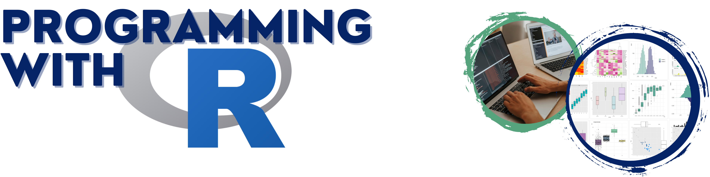

Interested in getting started with R programming, but don't know anything about programming or data analysis ... then come join us for our two-day bootcamp.  

This training will be focused around **hands-on learning activities** and you are welcome to submit your own data prior to the workshop - if you are lucky it will be chosen as an example data set. 

You will be introduced to the <a href="https://www.r-project.org/">R programming language</a> and to a popular editor <a href="https://posit.co/downloads/">Posit, formerly known as RStudio</a> while learning a little about Data Science. Example data sets will be used to practice data manipulation, organization, and graphical exploration. You are also encouraged to bring your own data and data challenges. In addition, major concepts of scientific research such as reproducibility will be addressed. Participants will gain the skills necessary to manage and organize data, run basic analyses, and generate beautiful, high-quality figures in R.

## Bootcamp Overview

R is a complete, flexible, and open source system for statistical analysis and graphics, and has become a tool of choice for many life scientists. 

### Day 1: R Crash Course with Introduction to Data Analytics

Day 1 will be an introduction to programming with R and teach you how to use Rstudio. R basics will be covered, such as using the command line as a calculator, storing values in a variable, **basic data structures (vector, matrix, list, data frame, etc.)**, and data types. We will show how to **read-in basic data sets** and access rows/columns, and summarize data with statistics and plots. Then we will move on to **scripting in R, including control flow (choices and loops), writing functions, and installing/loading libraries** (and the differences between CRAN, GitHub, and Bioconductor packages).  

### Day 2: Tidy R, Figures, and Reproducibility 

We will discuss commonly seen coding problems and introduce what it means to **conduct reproducible data science**. During the second day, we will go through an example of **setting up a new project folder, loading "messy" data, organizing scripts, creating high quality plots, and creating output files**. In reference to the messy data, we will go over what "tidy" data is, and how to use `tidyverse` libraries. Then will go over some **principles of the visual display of quantitative data**, and go more into plotting in R with `base` and `ggplot2`.

 

## Schedule

<table class="tg">
<thead>
  <tr>
    <th>Outline</th>
    <th>Date and Time</th>
  </tr>
</thead>
<tbody>
  <tr>
    <td>[R Crash Course with Introduction to Data Analytics]</td>   <!--(#intro1) before td to make a link-->
    <td>March 20, 2023, 9 - 4pm</td>
  </tr>
  <tr>
    <td>[Tidy R, Figures, and Reproducibility]</td>   <!--(#intro2)-->
    <td>March 21, 2023, 9 - 4pm</td>
  </tr>

</tbody>
</table>
**noon - 1pm: lunch on your own**

 

## Things to Know

### Audience and Prerequisites

**No prior knowledge about data analytics or coding experience are necessary!**

 This bootcamp is addressed to beginners wanting to become familiar with the R syntax, environment, and the most common commands to start using R to explore, interpret, and present their data.

This **is NOT a training on statistics** but rather a training on how to use R to perform different tasks.

You will need your own laptop and must install <a href="https://www.r-project.org/">R  language</a> and <a href="https://posit.co/downloads/">Posit (aka RStudio)</a> prior to the training, follow the instructions on their websites. We recommend to first download R and then Posit. 

You are encouraged to go through some of the R documentation: https://www.r-project.org/.

### Application and Registration Fee

Application is required to be considered to participate. Students and faculty from TMCC, WNC, SNU, and UNR interested in R are encouraged to apply. This is a two day workshop and participants must attend both days to be considered for a registration waiver. g

**For students:**

<a href="https://nvideaoffice.formstack.com/forms/bootcamp_application">Click here to be taken to the application form</a>

Application requires:

- Copy of unofficial transcript
- Academic references
- Personal statements
  - Tell us about yourself and why you are interested (1000-character limit)
  - How will this workshop affect your academic and professional career (1000-character limit)
  - Any research you may currently be involved in (1000-character limit)
  - Anything else you want to share (1000-character limit)

Application is open until **March 13th ,2023 **, but will close as soon as spots are filled with qualifying participants.

You will receive an email to confirm participation confirmation by no later than March 15th, 2023. Upon reception of the confirmation email, participants will be asked to confirm their attendance within 2 days. 

**For faculty:**

Please email <nbc_training@unr.edu>  to  Dr. Juli Petereit directly at <jpetereit@unr.edu> (priority will be given to students, but we are planning a faculty-specific workshop, and your interest/feedback would be appreciated).

### Additional Information

Coordinator: Juli Petereit

Non-UNR affiliates will receive a parking pass sponsored by NV INBRE.

Participants attending all section will receive a certificate of completion. 

Important: 

- Applications from TMCC, WNC, and SNU will receive priority
- Attendance is required in-person

<!-- --- -->

<!-- ## Schedule {#schedule} -->

<!-- <table class="tg"> -->
<!-- <thead> -->
<!--   <tr> -->
<!--     <th>Workshop</th> -->
<!--     <th>Date and Time</th> -->
<!--   </tr> -->
<!-- </thead> -->
<!-- <tbody> -->
<!--   <tr> -->
<!--     <td>[Introduction to R Part 1](#intro1)</td> -->
<!--     <td>March 20, 2023, 9-12</td> -->
<!--   </tr> -->
<!--   <tr> -->
<!--     <td>[Introduction to R Part 2](#intro2)</td> -->
<!--     <td>March 20, 2023, 1-4pm</td> -->
<!--   </tr> -->
<!--   <tr> -->
<!--     <td>[Reproducible Data Science and Tidy R](#reproduce)</td> -->
<!--     <td>March 21, 2023, 9-12pm</td> -->
<!--   </tr> -->
<!--   <tr> -->
<!--     <td>[Producing Clean Documents, Graphs, and Tables](#tidy)</td> -->
<!--     <td>March 21,2023 1-4pm</td> -->
<!--   </tr> -->
<!--   </tr> -->
<!-- </tbody> -->
<!-- </table> -->

<!-- --- -->

<!-- ## Details -->

<!-- ### Introduction to R Part 1 {#intro1} -->

<!-- This workshop serves as a gentle introduction to programming with R. R basics will be covered, such as using the command line as a calculator, storing values in a variable, basic data structures (vector, matrix, list, data frame, etc.), and data types. We will show how to load basic data sets and access rows/columns, and summarize data with statistics and plots.  -->

<!-- #### Objectives -->

<!-- Participants will be able to: -->

<!-- - open the R command line interface (CLI) -->
<!-- - access the built-in help docs -->
<!-- - perform basic arithmetic using R -->
<!-- - store data in variables -->
<!-- - list the environment variables -->
<!-- - understand the basic data types in R -->
<!-- - convert between the different data types -->
<!-- - understand and use the basic data structures in R -->
<!-- - access rows, columns, and elements of matrices and data frames -->
<!-- - read data from a `csv` into a data frame -->
<!-- - fit simple linear models -->
<!-- - summarize data and linear models -->
<!-- - create simple plots of 1-D and 2-D data -->

<!-- ### Introduction to R Part 2 {#intro2} -->

<!-- This workshop introduces scripting in R, including control flow, writing functions, and installing/loading libraries (and the differences between CRAN, GitHub, and Bioconductor packages). We will teach you how to use RStudio.  We will go over the `-apply` family of functions, simple graphs, and good practices in R (style guide, organization, etc.). -->

<!-- #### Objectives -->

<!-- Participants will be able to: -->

<!-- - open up RStudio and identify key parts of the IDE -->
<!-- - create, open, and save R scripts -->
<!-- - run R scripts line by line or all at once -->
<!-- - understand and use the `-apply` family of functions -->
<!-- - use control flow to execute complex tasks -->
<!-- - write functions and understand when to use them -->
<!-- - install and load packages -->
<!-- - look up help for packages -->
<!-- - understand the differences between CRAN, Bioconductor, and GitHub -->
<!-- - understand what a style guide is and why it is important -->
<!-- - use good practices for writing and organizing code -->

<!-- ### Reproducible Data Science and tidyverse {#reproduce} -->

<!-- We will discuss the problems we commonly see and introduce what it means to conduct reproducible data science. During the workshop, we will go through an example of setting up a new project folder, loading "messy" data, organizing scripts, and creating basic Rmarkdown reports. In reference to the messy data, we will go over what "tidy" data is, and how to use `tidyverse` libraries. -->

<!-- #### Objectives -->

<!-- Participants will be able to: -->

<!-- - understand the principles of reproducible [data] science -->
<!-- - identify bad project management habits -->
<!-- - organize a new project folder -->
<!-- - write code that is human-readable -->
<!-- - identify helpful libraries for data wrangling -->
<!-- - understand and implement the principles of immutable data -->
<!-- - create reports and other media using Rmarkdown -->
<!-- - understand how to incorporate Github  -->

<!-- ### Producing Documents, Graphs, and Tables {#docs} -->

<!-- In this workshop, we will go over some principles of the visual display of quantitative data, and go in-depth with plotting in R with `base` and `ggplot2`. Additionally, since not all data is well represented in a graph, we will go over creating pretty tables using the `kable` and `kableExtra` packages. -->

<!-- #### Objectives -->

<!-- Participants will be able to -->

<!-- - understand the basic principles of the visual display of quantitative information -->
<!-- - produce clean and professional graphs using base `R` -->
<!-- - produce clean and professional graphs using `ggplot2` -->
<!-- - produce clean tables using `kable` and `kableExtra` -->
<!-- - create clean documents using `Rmarkdown` -->

## Acknowledgements

We thank Nevada INBRE, UNR's Graduate Student Association, and UNR's Graduate School for offering limited number of registration waivers to students and postdoctoral fellows. 

