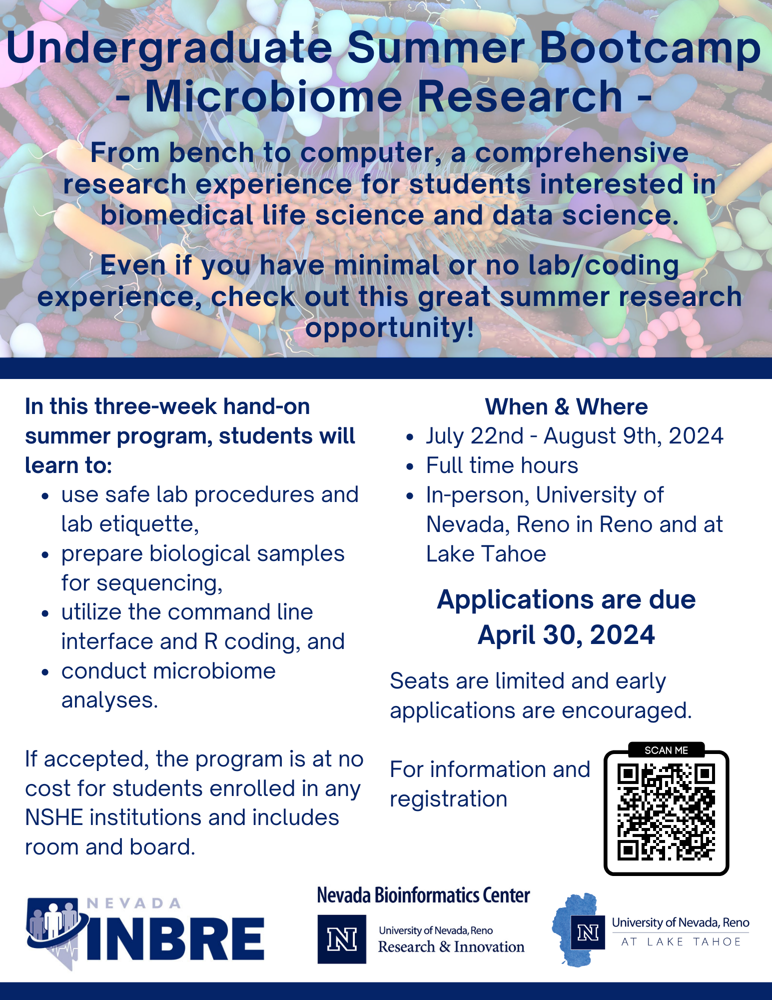

From bench to computer, a comprehensive research experience for students interested in biomedical life science and data science.  

The primary objective of this program is to expose undergraduate students to microbiome research at the University of Nevada, Reno. 

During this three-week program participants will be introduced to:

 - Safe lab procedures and etiquette
 - DNA extraction and sample preparation for sequencing
 - Introduction to research computing (cloud and/or high-performance computing, Linux)
 - R coding
 - Bioinformatics and data science
 - Analysis of 16S rRNA sequencing data
 - Interpretation of microbiome data
 - Creation of scientific poster and presentation

For NSHE faculty: If you are interested in participating or supporting this program, please reach out to nvinbre@unr.edu. We certainly would welcome the support.

## Eligibility & How to apply

The program is directed towards students who have completed at least their freshman year of undergraduate education and are 18 years or older. Seniors with a graduation date of August 2024 or after are also welcome to apply. Graduate students will be considered if the available spots are not filled by undergraduates.

Student application is due Tuesday April 30, 2024. 

### How to apply

1. Complete and submit an online application here. 
2. Prepare and upload a one single-spaced page personal statement that addresses 
    a) your academic background
    b) your scientific interests
    c) your research experience if any (none are required, but if you do we would like to know about it)
    d) what you hope to gain from the research experience.
3. Upload your current unofficial transcript
4. Indicate one academic reference, and provide their contact information in the application form. 
    The application will automatically send them a link to the reference form to fill out. All references need to be submitted directly by the author by Friday, May 3. Your references will not receive the link to the reference form until your application is fully submitted. Please be sure to allow enough time for your references to complete the reference form by the deadline. 

Applications will be reviewed by the review committee and selected applicants will be notified of acceptance by May 11. Acceptance by the student will need to be confirmed by May 18 due to the competitiveness of this application and limited space.

## Program Details

The summer research program runs for three weeks from Monday, July 22 through Friday, August 9, 2024. 

Week 1: Wet-lab, preparing samples for sequencing

Week 2: Introduction to biomedical data science and bioinformatics

Week 3: Analyzing sequencing samples and presenting research findings

The program's project is designed to give the student an in-depth, hands-on exposure to biomedical research. Although the focus is on the microbiome, many of these skills are transferable and can be applied to other areas. The program will give students the unique experience of starting at the wet-lab bench preparing samples for sequencing, and will end with analyzing the samples via bioinformatics and biomedical data science. As such this program is of interested to students majoring in any of the life sciences, but also computational students interested in computer science and statistics.

There are no prerequisites, but lab experience or familiarity with R coding will be beneficial for participants.

Throughout the three weeks, students will be able to tour the University's campus in Reno and Incline Village, meet a variety of researchers, and be introduced to various scientific technologies beyond microbiome research.

Students will present their research via Scientific Poster at the Wolf Pack Discoveries, an undergraduate research symposium. 

It is expected that students will provide a one-page summary of the summer experience to the program director within 30 days after completion of their project.

This program is at no cost for accepted students enrolled in any NSHE institution and includes room and board. 

## Logistics

This program will be conducted in person at the University of Nevada, Reno in Reno and Incline Village. 

Dorm rooms (double occupancy) in Reno will be available for students who are not local to Reno (further than 30 miles from the University's campus); dorm rooms in Incline Village will be provided to all students.

Travel arrangement will need to be coordinated with program coordinator. 

More details about the program will be shared upon acceptance. 

<!-- ## Workshop Overview -->

<!-- ### Introduction & Setup -->

<!-- During the initial session, we will ensure everyone is configured and can successfully access Pronghorn. We'll also delve into the discussion of local computing resources and the group's interest in Research Computing.  -->

<!-- ### Mastering Command-Line Basics & UNIX Fundamentals -->

<!-- Moving on to the second session, our focus will shift towards mastering the UNIX file structure. We'll cover all the fundamental commands required to efficiently navigate, interact with, and manipulate files. -->

<!-- ### Creating Analysis Scripts & Navigating the SLURM Job Scheduler -->

<!-- In the concluding session, our attention will be on interacting with the SLURM job scheduler. The agenda includes hands-on activities starting by testing an analysis on a compute node, followed by scripting for automated analysis execution, and conversion of the script into an SBATCH script for running the analysis on Pronghorn. Additionally, we will cover the process of transferring files to and from Pronghorn. -->

<!-- ## Things to Know -->

<!-- ### Where -->
<!-- This is an in-person event and will be held on UNR's main campus; room information will be shared with accepted applications.  -->
<!--   -->

<!-- ### Who -->
<!-- The workshop’s intended audience are graduate students, but everyone interested in utilizing HPC is welcome to participate - but registration is required, keep on reading.**No prior programming or HPC experience is required.** -->
<!--   -->

<!-- ### When -->

<!--   -->
<!-- <table class="tg"> -->
<!-- <thead> -->
<!--   <tr> -->
<!--     <th>Module</th> -->
<!--     <th>Day</th> -->
<!--     <th>Time</th> -->
<!--   </tr> -->
<!-- </thead> -->
<!-- <tbody> -->
<!--   <tr> -->
<!--     <td>Day 1: Introduction & Setup</td> -->
<!--     <td>Thursday, 11/02/23</td> -->
<!--     <td>3:00pm – 5:00pm</td> -->
<!--   </tr> -->
<!--   <tr> -->
<!--     <td>Day 2: Mastering Command-Line Basics & UNIX Fundamentals</td> -->
<!--     <td>Thursday, 11/09/23</td> -->
<!--     <td>1:30pm – 5:00pm</td> -->
<!--   </tr> -->
<!--   <tr> -->
<!--     <td>Day 3: Creating Analysis Scripts & Navigating the SLURM Job Scheduler</td> -->
<!--     <td>Thursday, 11/16/23</td> -->
<!--     <td>1:30pm – 5:00pm</td> -->
<!--   </tr> -->

<!-- </tbody> -->
<!-- </table> -->
<!--   -->

<!-- ### Interested -->
<!-- Space is limited and confirmation of participation will be required. Registration is due by **October 31st, 2023**. Late application might be considered if space is available. -->

<!-- 
<a href="https://nvideaoffice.formstack.com/forms/researchcomputing">Click HERE to Register for the Workshop</a> 
 -->

<!--   -->

<!-- In addition to the registration you need to complete  onboard with UNR's HPC pronghorn system.  -->

<!-- 
<a href="https://nevada.formstack.com/forms/high_performance_computing_application">Click HERE to Complete HPC Onboarding Form</a> 
 -->

<!--   -->

<!-- Questions?? Reach out at any time, email nbc_training@unr.edu or call (775) 784-4359. -->

### Flier

### Presenters
Nevada Bioinformatics Center / Nevada INBRE Data Science Core

 - Juli Petereit, PhD 

Department of Nutrition

 - Steven Frese, PhD
 - Matt Bolino
 - Karla Flores Martinez

### Acknowlegement
This bootcamp is made possible by a grant from the National Institute of General Medical Sciences (GM103440) from the National Institutes of Health.

