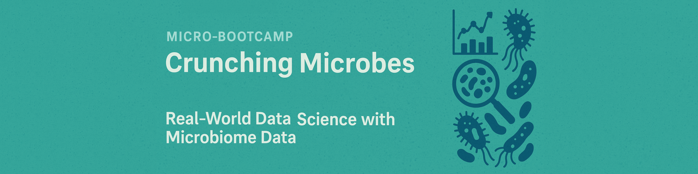
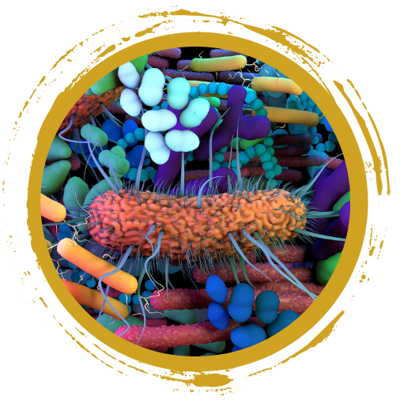
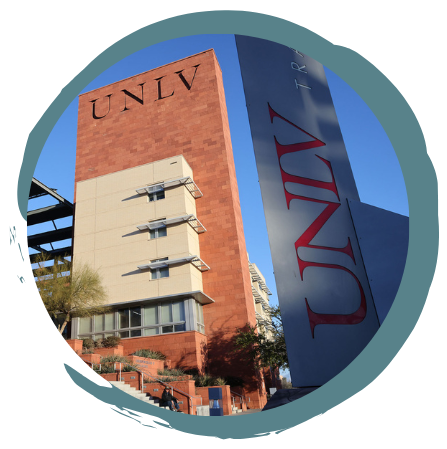
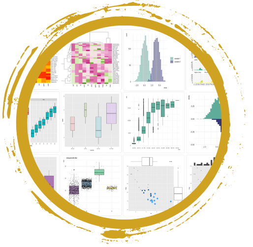
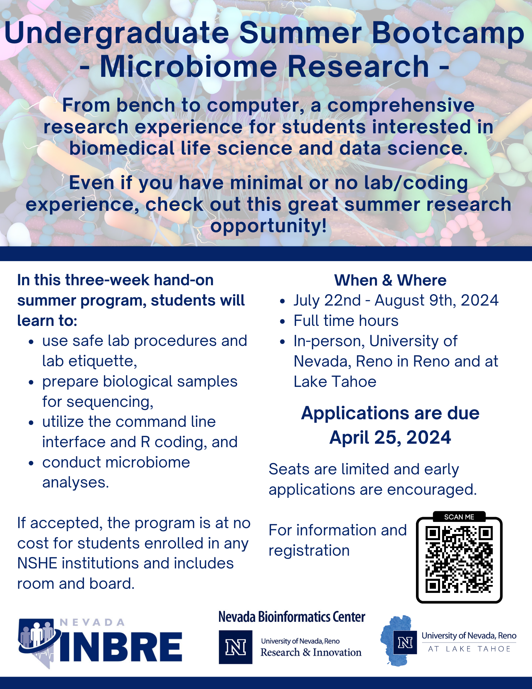
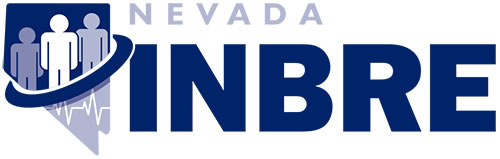
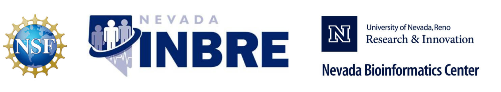

 

**August 11 - August 14, 2025 • University of Nevada, Las Vegas • Full‑time in‑person**

  

A gentle introduction to (biomedical) data science using real-world microbial data from an ongoing research study.  

The primary objective of this program is to expose undergraduate students to (biomedical) data science applied to microbiome research. 

During this three and a half (3.5) day training program participants will be introduced to:

 - Hands-on R training for data science beginners
 - Explore real microbiome data from the *Wolfpack Study*
 - Learn microbiome quality control, taxonomic analysis, and visualization
 - Generate a research hypothesis – and test it!
 - Present your findings in a 3-minute flash talk

**For NSHE faculty:** If you are interested in participating or supporting this program, please reach out to nbc_training@unr.edu. We certainly would welcome your support.

<!-- ## Blast from the Past -->

<!-- <a href="https://www.unr.edu/nevada-today/news/2023/microbiome-research-program">Check out the Nevada Today Article about our program.</a> -->

<!--  -->

 

### Eligibility & How to apply

The program is directed towards students who have completed at least their freshman year of undergraduate education. Seniors with a graduation date of August 2025 or thereafter are also welcome to apply. Graduate students will be considered if the available spots are not filled by undergraduates.

**Applications close on Monday August 4, 2025.**

Limited seats available – first come, first served. 

  

### How to apply

Complete and submit an online application/registration. 
 
Registrations will be reviewed every Friday until August 4 or until the micro-boot camp is full. Acceptance by the student will need to be confirmed within 5 days. If circumstances change and you can no longer participate, please inform us as soo as possible, so that a reserved spot can be passed on to another student. 

<a href="https://nvideaoffice.formstack.com/forms/crunchingmicrobes">**Apply Now!**</a>

 

### Program Details

The summer micro-research program runs from **Monday, August 11 through Thursday, August 14, 2025**. 

This guided micro-research experience offers an immersive journey into biomedical research, with a primary focus on the gut microbiome. Its structured approach equips students with valuable hands-on skills applicable across various domains. Beginning with a gentle introduction to R coding and the gut microbiome, participants progress to the analysis phase using bioinformatics and biomedical data science tools. This program appeals not only to life science majors but also to computational students interested in computer science, data science, and statistics. The program offers a unique and enriching learning opportunity for aspiring researchers in diverse disciplines.

Students will be using and analyzing samples from [Dr. Steven Frese's Wolf Pack Study](https://freselab.org/wolfpack/). 

There are no prerequisites!

Students will work in groups of 2-4, develop a research question, and present their findings via a 3-minute flash talk at the end of the program.

Please note that this training event is a full-time commitment from August 11 - August 14, 2025

**This training event is free for NSHE students.**

 

### Where \& When

This is an in-person event and will be held on the **University of Nevada, Las Vegas main campus**.

<!--   -->

<!-- ### When -->

<table class="tg">
<thead>
  <tr>
    <th>Module</th>
    <th>Day</th>
    <th>Time</th>
  </tr>
</thead>
<tbody>
  <tr>
    <td>Day 1: Welcome + Intro to R</td>
    <td>Monday 8/11/25 </td>
    <td>1pm – 5pm</td>
  </tr>
  <tr>
    <td>Day 2: Continue R + Intro to microbiome + Study design + Hypothesis development </td>
    <td>Tuesday 8/12/25 </td>
    <td>8:30am – 5pm</td>
  </tr>
  <tr>
    <td>Day 3: Microbiome QC + Taxonomy + Visualization</td>
    <td>Wednesday 8/13/25 </td>
    <td>8:30am – 5pm</td>
  </tr>
  <tr>
    <td>Day 4: Your analysis + Flash talk presentations </td>
    <td>Thursday 8/14/25 </td>
    <td>8:30am – 5pm</td>
  </tr>
</tbody>
</table>

<!-- ### Logistics -->

<!-- Dorm rooms (triple occupancy) in Reno will be available for students who are not local to Reno (further than 30 miles from the University's campus); dorm rooms (triple occupancy) in Incline Village will be provided to **all** students. -->

<!-- Travel arrangement will need to be coordinated in a timely fashion with the program coordinator after acceptance to the program.  -->

<!-- More details about the program will be shared upon acceptance. -->
 

### Questions

Reach out at any time, email nbc_training@unr.edu or call (775) 784-4359.

<!-- ### Flier -->

<!-- 

 -->

### Presenters
Nevada Bioinformatics Center / Nevada INBRE Data Science Core

 - Juli Petereit, PhD 
 - Cassandra Hui, PhD

Department of Nutrition

 - Steven Frese, PhD
 - Matt Bolino

### Acknowlegement
This bootcamp is made possible by grants from the National Institute of General Medical Sciences (GM103440) from the National Institutes of Health and and the National Science Foundation (2203236).

<!--  -->

 

