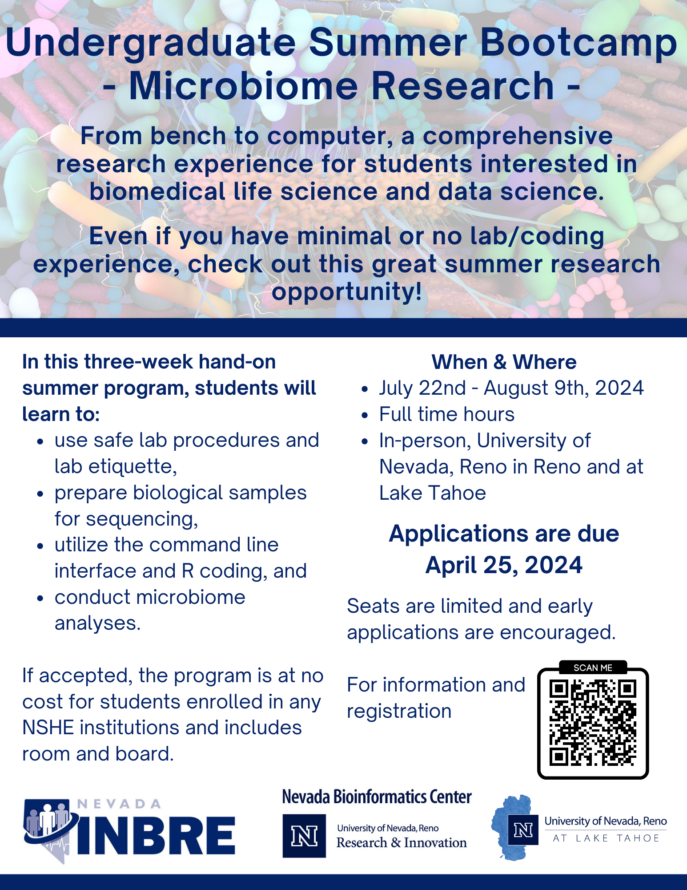

**July 21 - August 8, 2025**

From bench to computer, a comprehensive research experience for students interested in biomedical life science and data science.  

The primary objective of this program is to expose undergraduate students to microbiome research at the University of Nevada, Reno. 

During this three-week program participants will be introduced to:

 - Safe lab procedures and etiquette
 - DNA extraction and sample preparation for sequencing
 - Introduction to research computing (cloud and/or high-performance computing, Linux)
 - R coding
 - Bioinformatics and data science
 - Analysis of 16S rRNA sequencing data
 - Interpretation of microbiome data
 - Creation of scientific poster and presentation

**For NSHE faculty:** If you are interested in participating or supporting this program, please reach out to nvinbre@unr.edu. We certainly would welcome the support.

## Blast from the Past

<a href="https://www.unr.edu/nevada-today/news/2023/microbiome-research-program">Check out the Nevada Today Article about our program.</a>

  

## Eligibility & How to apply

The program is directed towards students who have completed at least their freshman year of undergraduate education and are 18 years or older. Seniors with a graduation date of August 2024 or after are also welcome to apply. Graduate students will be considered if the available spots are not filled by undergraduates.

**Applications are due Thursday April 24, 2024.**

Early applications are encouraged, spots are limited. 

### How to apply

1. Complete and submit an online application 
2. Prepare and upload a one single-spaced page personal statement that addresses 
    a) your academic background
    b) your scientific interests
    c) your research experience if any (none are required, but if you do we would like to know about it)
    d) what you hope to gain from the research experience.
3. Upload your current unofficial transcript
4. Indicate one academic reference, and provide their contact information in the application form. 
    The application will automatically send them a link to the reference form to fill out. All references need to be submitted directly by the author by Friday, May 3. Your references will not receive the link to the reference form until your application is fully submitted. Please be sure to allow enough time for your references to complete the reference form by the deadline. 

Applications will be reviewed by the review committee and selected applicants will be notified of acceptance by May 3. Acceptance by the student will need to be confirmed by May 10 due to the competitiveness of this application and limited space.

<!-- 
<a href="https://nvideaoffice.formstack.com/forms/bootcamp_application">**Apply Now!**</a>
 -->

 

## Program Details

The summer research program runs for three weeks from **Monday, July 21 through Friday, August 8, 2025**. 

This guided research experience offers an immersive journey into biomedical research, with a primary focus on the gut microbiome. Its structured approach equips students with valuable hands-on skills applicable across various domains. Beginning with wet-lab bench work involving sample preparation for sequencing, participants progress to the analysis phase using bioinformatics and biomedical data science tools. This holistic approach ensures participants gain comprehensive insights into both laboratory techniques and computational methodologies. Consequently, the program appeals not only to life science majors but also to computational students interested in computer science, data science, and statistics. By providing a blend of practical laboratory experience and computational analysis, this program offers a unique and enriching learning opportunity for aspiring researchers in diverse disciplines.

Students will be preparing and analyzing samples from [Dr. Steven Frese's Wolf Pack Study](https://freselab.org/wolfpack/) - if you are interested you can anonymously submit a sample, become part of the study, and take a look at your own gut microbiome. 

There are no prerequisites, but lab experience or familiarity with R coding will be beneficial for participants.

Throughout the three weeks, students will be able to tour the University's campus in Reno and Incline Village, meet a variety of researchers, and be introduced to various scientific technologies beyond microbiome research.

Students will work in groups of 2-4, develop a research questions, and present their research findings via a Scientific Poster at Wolf Pack Discoveries, an undergraduate research symposium. 

Students are not allowed to be enrolled in any credited courses during the time of the bootcamp, and will not be able to work - this training is a full-time commitment. 

It is expected that students will provide a one-page summary of the summer experience to the program director within 30 days after completion of their project.

**This program is at no cost for accepted students enrolled in any NSHE institution and includes room and board.**

### Where

This is an in-person event and will be held on UNR's main campus in Reno and the [campus at Lake Tahoe, Incline Village](https://www.unr.edu/lake-tahoe).

<!-- ### When -->

<!-- <table class="tg"> -->
<!-- <thead> -->
<!--   <tr> -->
<!--     <th>Module</th> -->
<!--     <th>Day</th> -->
<!--     <th>Time</th> -->
<!--   </tr> -->
<!-- </thead> -->
<!-- <tbody> -->
<!--   <tr> -->
<!--     <td>Week 1: Wet-lab, preparing samples for sequencing</td> -->
<!--     <td>Monday 7/22/24 - Friday 7/26/24 </td> -->
<!--     <td>8:30am (+/-) – 5:30pm (+/-)</td> -->
<!--   </tr> -->
<!--   <tr> -->
<!--     <td>Free Time in Reno </td> -->
<!--     <td>Saturday 7/27/24 - Sunday 7/28/24 </td> -->
<!--     <td></td> -->
<!--   </tr> -->
<!--   <tr> -->
<!--     <td>Week 2: Introduction to biomedical data science and bioinformatics</td> -->
<!--     <td>Monday 7/29/24 - Friday 8/02/24 </td> -->
<!--     <td>8:30am (+/-) – 5:30pm (+/-)</td> -->
<!--   </tr> -->
<!--   <tr> -->
<!--     <td>*Moving to Incline Village, Lake Tahoe* </td> -->
<!--     <td>Thursday 8/01/24 </td> -->
<!--     <td></td> -->
<!--   </tr> -->
<!--   <tr> -->
<!--     <td>Free Time at Lake Tahoe </td> -->
<!--     <td>Saturday 8/03/24 - Sunday 8/04/24 </td> -->
<!--     <td></td> -->
<!--   </tr> -->
<!--   <tr> -->
<!--     <td>Week 3: Analyzing sequencing samples and presenting research findings</td> -->
<!--     <td>Monday 8/05/24 - Thursday 8/08/24 </td> -->
<!--     <td>8:30am (+/-) – 5:30pm (+/-)</td> -->
<!--   </tr> -->
<!--   <tr> -->
<!--     <td>*Check out, back to Reno*, Wolf Pack Discoveries</td> -->
<!--     <td>Friday 8/09/24 </td> -->
<!--     <td>8am (+/-) – 4:30pm (+/-)</td> -->
<!--   </tr> -->
<!-- </tbody> -->
<!-- </table> -->

### Logistics

Dorm rooms (triple occupancy) in Reno will be available for students who are not local to Reno (further than 30 miles from the University's campus); dorm rooms (triple occupancy) in Incline Village will be provided to **all** students.

Travel arrangement will need to be coordinated in a timely fashion with the program coordinator after acceptance to the program. 

More details about the program will be shared upon acceptance.
 

### Questions

Reach out at any time, email nvinbre@unr.edu or call (775) 784-4359.

<!-- ### Flier -->

<!-- 

 -->

### Presenters
Nevada Bioinformatics Center / Nevada INBRE Data Science Core

 - Juli Petereit, PhD 
 - Cassandra Hui, PhD

Department of Nutrition

 - Steven Frese, PhD
 - Matt Bolino

### Acknowlegement
This bootcamp is made possible by a grant from the National Institute of General Medical Sciences (GM103440) from the National Institutes of Health.

