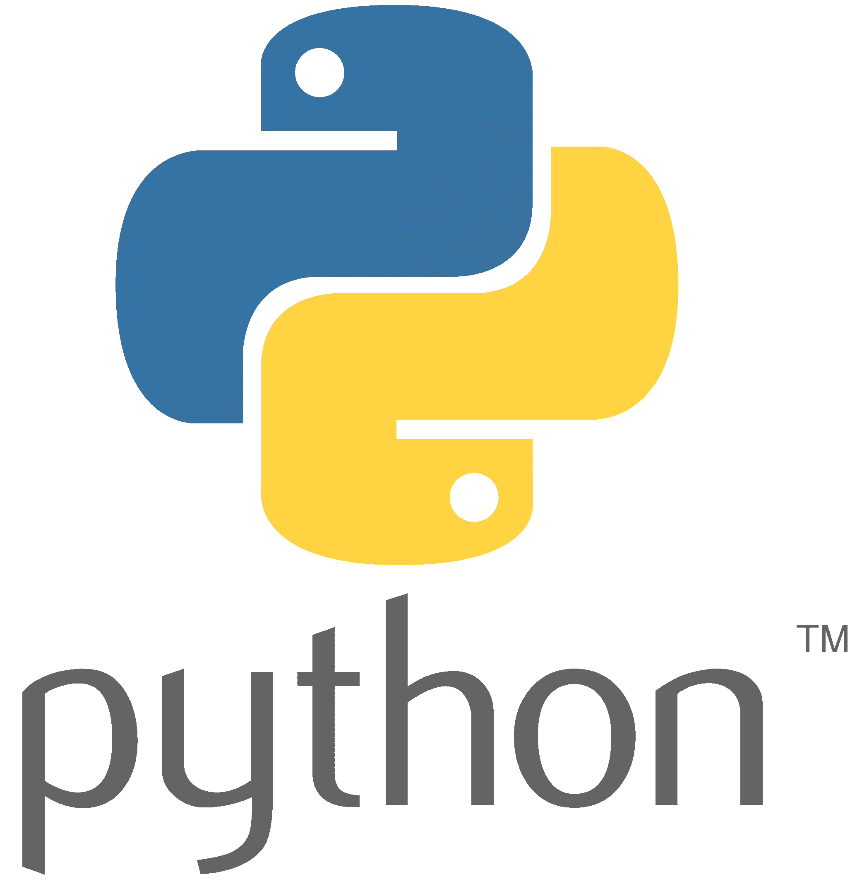

To tackle these types of problems, we can use supervised learning - the branch of Artificial Intelligence that uses labeled data to train algorithms for a particular task!

<a href="https://med.unr.edu/inbre">Nevada INBRE</a> and the <a href="https://www.unr.edu/bioinformatics">Nevada Bioinformatics Center</a> are pleased to announce the upcoming Python for Supervised Machine Learning Bootcamp. Through hands-on learning activities, we will cover 

 - Module 1: Basics of Python for Data Science 
 - Module 2: Fundamentals of Machine Learning for Classification and Regression 
 - Module 3: Introductory of Deep Learning / Neural Networks for Computer Vision and Other Applications
 
You will come out of the bootcamp understanding how to wrangle data, build and train both simple and sophisticated models, and evaluate your models in the context of different use cases. 

## Bootcamp Overview

### Module I: Python Crash Course
 Python is a high-level, general-purpose, and open source programming language. It is emerging as one of the most popular programming languages, both for scientific computing and general use. In the python crash course, we will cover an overview of python and programming fundamentals, and then describe how to use python for data processing, analysis, and visualization. At the end of this module, you will be able to:

- Write and debug basic python code
- Use functions, loops, conditional statements, and more advanced data structures to build higher level programs
- Analyze a dataset using python libraries built for data science
- Process your data for downstream applications, such as machine learning

### Module II: Fundamentals of Supervised Machine Learning
Supervised machine learning - the genre of machine learning that learns from past measurements or signals to make predictions on new data - has applications in nearly every field, from biology to art, astronomy to history. In this second part of the course, we will cover the fundamentals of supervised machine learning, working through the intuition behind supervised machine learning models and doing hands-on model development. At the end of this module you, you will be able to:

- Describe the intuition and concepts behind supervised machine learning, from both a high-level overview, and from a technical perspective
- Build, train, and test classification and regression models using python’s machine learning libraries
- Diagnose, tune, and refine your models in order to improve performance
- Identify the use cases and limitations of various machine learning models and datasets

### Module III: Introduction to Deep Learning 
Many believe that the most exciting branch of machine learning today is deep learning, a type of supervised machine learning that uses a neural network to make predictions on large, highly featured datasets (and is particularly powerful for images). In this module, we will extend what we have learned about supervised machine learning in order to develop and analyze deep learning models. Again, we will work through both the concepts central to deep learning, and perform hands-on model building, At the end, you will be able to:

- Describe the intuition, use cases, and limitations of fully-connected neural networks, a convolution kernel, and convolution neural networks
- Manipulate and preprocess image data to be used in deep learning models
- Use Keras/TensorFlow to construct your own neural networks and apply popular model architectures to classification tasks
- Refine and evaluate your deep learning models

## Things to Know

### Audience and Prerequisites

No prior knowledge of coding or machine learning are necessary! This bootcamp is intended for novice scientists wanting to become familiar with Python and ML concepts enabling them to applied these methods to their own research endeavors. The material will be geared for graduate research projects, but everyone is encouraged to apply for participation. **Priority will be given to graduate students.**

### Application and Registration Fee

Spots are limited. Application for participation will be due **September 29th, 2022**. Late application will not be considered unless open seats remain. 

<table class="tg">
<thead>
  <tr>
    <th>Module</th>
    <th>Date and Time</th>
    <th>Registration Fee</th>
  </tr>
</thead>
<tbody>
  <tr>
    <td>Python Crash Course</td>
    <td>October 20 & 21, 2022, 12:30-5pm</td>
    <td>$100</td>
  </tr>
  <tr>
    <td>Fundamentals of Supervised Machine Learning</td>
    <td>November 3 & 4, 2022, 12:30-5pm</td>
    <td>$100</td>
  </tr>
  <tr>
    <td>Introduction to Deep Learning</td>
    <td>November 17 & 18, 2021, 12:30-4pm</td>
    <td>$100</td>
  </tr>
</tbody>
</table>

**A \$50 discount will be applied when registering for all three modules totaling \$250 for the entire bootcamp.**

Application requires:

- Complete online application form
- Indicate 1 academic reference, and provide their contact information in the application form. The application will automatically send them a link to the brief reference form to fill out. All references need to be submitted directly by the author. Your references will not receive the link to the reference form until your application is fully submitted. Please be sure to allow enough time for your references to complete the form by October 4, 2022.

If you are interested in applying for a **Registration Waiver** addition materials are required: 

- Copy of unofficial transcript
- Personal statements not to exceed one page should address the following 
  - Academic background and research interests
  - Why you are interested in this bootcamp and what you hope to gained from this training
  - How will this training affect your academic/research/professional career
  - Anything else you want to share
  
<a href="https://nvideaoffice.formstack.com/forms/pythonmachinelearningbootcamp">Click here to be taken to the application form</a>

Application is open until **September 29, 2022**, applications will be reviewed shortly thereafter. Accepted and waitllisted applicants and waiver notifications will go out by October 7, 2022. Upon reception of the confirmation email, participants will be asked to confirm their attendance within 2 working days days. 

### Additional Information

Coordinator: Juli Petereit, <jpetereit@unr.edu> 

Instructor:  Brianna Sierra Chrisman

Important: 

- Graduate student applications will receive priority
- Attendance is required in-person
- No-show policy: the associated lab/PI will be charged the registration fee even when a waiver was granted. In other words, if you don't intend to actually be there, don't register and take a spot from another student 
- Certificate of Completion can be requested

## Acknowledgements

This bootcamp is partially supported by grants from the National Institute of General Medical Sciences (GM103440) from the National Institutes of Health and from the National Science Foundation (2203236 and 2141660).

We thank Nevada INBRE and UNR's Graduate School to offer registration waivers to support participation in this bootcamp. 

Comics thanks to https://xkcd.com/. 

