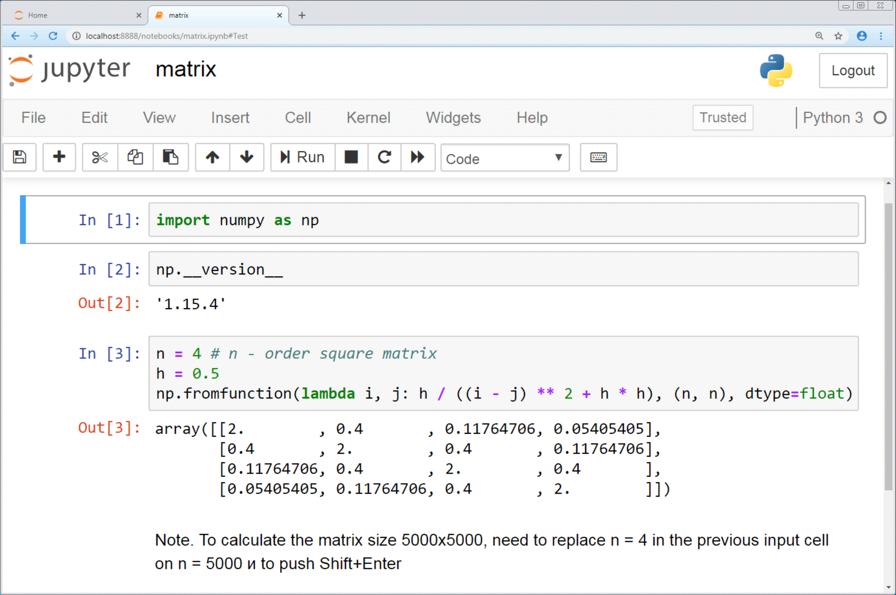

<style><!--Page specific style-->
  h1 {color: #000}
  h2 {color: #111}
  h3 {color: #222; border-bottom: 1px solid #ccc; width: 75%;}
  h4 {color: #666}
  .top {color: #ccc; display: inline-block; padding: 25px 0px 5px 0px;}
</style>





# The Notebook

A jupyter notebook is a document (produced by the jupyter notebook program) that contains both computer code (i.e., python) and rich text elements (subtitles, paragraphs, equations, figures, links, etc.). Notebook documents are both human-readable documents containing the analysis description and the results (figures, tables, etc.) as well as executable documents which can be run to perform data analysis. You can have multiple different jupyter notebooks saved in different file directories etc. A jupyter notebook is always saved as a .ipynb file.


## Jupyter Notebook Software

The Jupyter Notebook software is an application that allows editing and running notebook documents via a web browser. Behind the scenes, the code runs and is stored on on your computer's CPU, but can be accessed and edited from a web browser. Although the jupyter notebook uses a web browser, you do not need internet to run Jupyter. Your local computer, rather than an internet provider, acts as the server. You can also wire jupyter in such a way that jupyter executes on an HPC, cloud computer system, or other remote CPU/drive, while still being accessed from your laptop's browser.


## Jupyter Notebook Dashbaord

In addition to displaying/editing/running notebook documents, the Jupyter Notebook App has a “Dashboard” (Notebook Dashboard), a “control panel” showing local files and allowing to open notebook documents or shutting down their kernels.

You can also edit python scripts, text files, or most other files using the jupyter notebook dashboard on your browser.


## Kernel 

A notebook kernel is a “computational engine” that executes the code contained in a Notebook document. The ipython kernel, referenced in this guide, executes python code. Kernels for many other languages exist (official kernels).

When you open a Notebook document, the associated kernel is automatically launched. When the notebook is executed (either cell-by-cell or with menu Cell -> Run All), the kernel performs the computation and produces the results. Depending on the type of computations, the kernel may consume significant CPU and RAM. Note that the RAM is not released until the kernel is shut-down.


# Installing Jupyter Notebook

To install jupyter notebook download <a href="https://www.anaconda.com/products/distribution">anaconda</a> (a python source management package) for python3, 64 bits for your operating system (linux, macOS, or windows - jupyter will not work on chromebooks). Use the default settings for a single user.


# Running and Navigating Jupyter Notebook

## Kicking off Jupyter Notebook 

### Windows

#### Option 1: 
Click on the Jupyter Notebook icon in the start menu

#### Option 2:
1. Open up terminal in windows (cmd)
2. Type ```jupyter notebook```

### MacOS
1. Open terminal on mac
2. Type ```jupyter notebook```.

This should kick off a kernel (running inside terminal) and open up a browser with the jupyter notebook dashboard displayed.

The Jupyter Notebook App is a server that appears in your browser at a default address (http://localhost:8888). You can run many copies of the Jupyter Notebook App and they will show up at a similar address (only the number after “:”, which is the port, will increment for each new copy). Since with a single Jupyter Notebook App you can already open many notebooks, we do not recommend running multiple copies of Jupyter Notebook App.

## Creating a New Notebook
To create a new notebook, on the jupyter notebook dashboard navigate into the file directory in which you want to create your notebook and click New->Notebook.

## Editing the Notebook
Jupyter Notebooks consist of cells, blocks of code or text that can be moved around, formatted etc. We can have coding cells, which consist of (in the case of ipython)

Formatted text cells use markdown syntax. You can write paragraphs and bullet points, create headings/subheadings, and insert equations into these cells.
You can toggle whether a cell gets read as code or text by clicking on the cell and then using the dropdown code/raw text/markdown menu.

You can move cells up and down using the up.down arrows.

Text cells consist of python (or whatever code your kernel is set for) code.

## Running code in your notebook 
To run a block of code click on the block of code and click play. Alternatively, you can use shift + enter to run the cell you are on. To run all of the cells, slick kernel -> run all.

To interrupt the block of code running click kernel->interrupt execution.

To restart the runtime, click kernel->restart runtime. This will not delete your code but will clear all local variables, etc. 

## Jupyter File Directory Structure

When started, the Jupyter Notebook App can access only files within its start-up folder (including any sub-folder). No configuration is necessary if you place your notebooks in your home folder or subfolders. Otherwise, you need to choose a Jupyter Notebook App start-up folder which will contain all the notebooks.


### Change Jupyter Notebook Startup Folder

#### Windows
1. Copy the Jupyter Notebook launcher from the menu to the desktop.
2. Right click on the new launcher and change the Target field, change %USERPROFILE% to the full path of the folder which will contain all the notebooks.
3. Double-click on the Jupyter Notebook desktop launcher (icon shows [IPy]) to start the Jupyter Notebook App. The notebook interface will appear in a new browser window or tab. A secondary terminal window (used only for error logging and for shut down) will be also opened.

#### MacOS/linux
1. Click on spotlight, type terminal to open a terminal window.
2. Enter the startup folder by typing ```cd /some_folder_name```
3. Type jupyter notebook to launch the Jupyter Notebook App The notebook interface will appear in a new browser window or tab.


## Closing your kernel

Closing the browser (or the tab) will not close the Jupyter Notebook App. To completely shut it down you need to close the associated terminal.

The Jupyter Notebook App is a server that appears in your browser at a default address (http://localhost:8888). Closing the browser will not shut down the server. You can reopen the previous address and the Jupyter Notebook App will be redisplayed.

When a notebook is opened, its “computational engine” (called the kernel) is automatically started. Closing the notebook browser tab, will not shut down the kernel, instead the kernel will keep running until is explicitly shut down. To shut down a kernel, go to the associated notebook and click on menu File -> Close and Halt. Alternatively, the Notebook Dashboard has a tab named Running that shows all the running notebooks (i.e. kernels) and allows shutting them down (by clicking on a Shutdown button).

