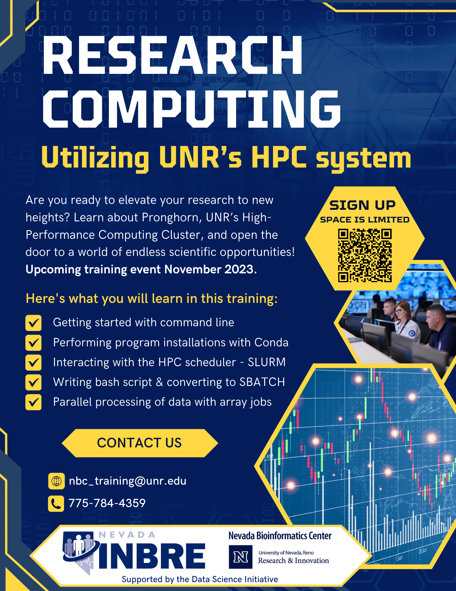

<!-- [Flyer](research_day_pdf.html) -->

Interested in learning about Research Computing?  
Ever wondered how advanced high performance computing can transform your academic and research pursuits? 
Want to learn how to take advantage of local resources? 

... then sign up for our **upcoming training event in November. ** 
 

Discover the power of Pronghorn, the cutting-edge HPC system on UNR's campus that could supercharge your research experience. Join us to embark on your journey from novice to HPC user in no time!

By the end of the workshop, you'll master the installations of programs using Conda, conquer the HPC scheduler (SLURM) like a pro, write simple bash scripts and converting them to SBTACH to allow for parallel processing.

Don't miss out on this opportunity to level up your HPC skills. 

## Workshop Overview

### Day 1: Introduction & Setup

In the first session we will make sure everyone is set up and can log into Pronghorn; we will discuss the local resources and the group's interst in Research Computing. 

**No prior programming or HPC experience is required.** 

### Day 2: 

Add information

### Day3: 

Add information

## Things to Know

### Where
This is an in-person event and will be held on UNR's main campus; room information will be shared with accepted applications. 
 

### Who
The workshop’s intended audience are graduate students, but everyone interested in utilizing HPC is welcome to participate - but registration is required, keep on reading.
 

### When

 
<table class="tg">
<thead>
  <tr>
    <th>Module</th>
    <th>Day</th>
    <th>Time</th>
  </tr>
</thead>
<tbody>
  <tr>
    <td>Day 1: Introduction & Setup</td>
    <td>Thursday, 11/02/23</td>
    <td>3:00pm – 5:00pm</td>
  </tr>
  <tr>
    <td>Day 2: Title</td>
    <td>Thursday, 11/09/23</td>
    <td>1:30pm – 5:00pm</td>
  </tr>
  <tr>
    <td>Day 2: Title</td>
    <td>Thursday, 11/16/23</td>
    <td>1:30pm – 5:00pm</td>
  </tr>

</tbody>
</table>
 

### Interested
Space is limited and confirmation of participation will be required. Registration is due by **October 31st, 2023**. Late application might be considered if space is available.

<a href="https://nvideaoffice.formstack.com/forms/researchcomputing">Click HERE to Register for the Workshop</a> 

 

In addition to the registration you need to complete  onboard with UNR's HPC pronghorn system. 

<a href="https://nevada.formstack.com/forms/high_performance_computing_application">Click HERE to Complete HPC Onboarding Form</a> 

 

Questions?? Reach out at any time, email nbc_training@unr.edu or call (775) 784-4359.

### Flier

### Presenters
Hans Vasquez-Gross, PhD from the Nevada Bioinformatics Center
John Anderson from OIT Research Computing

### Acknowlegement
This event is part of the Data Science Initiative and made possible by a grant from the National Institute of General Medical Sciences (GM103440) from the National Institutes of Health.

