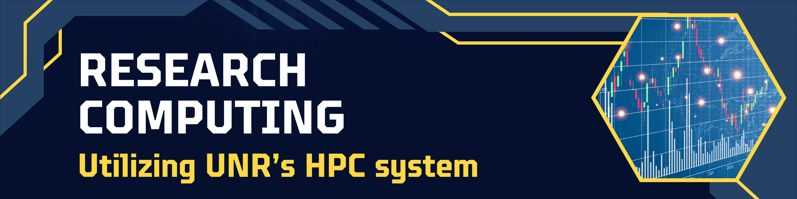
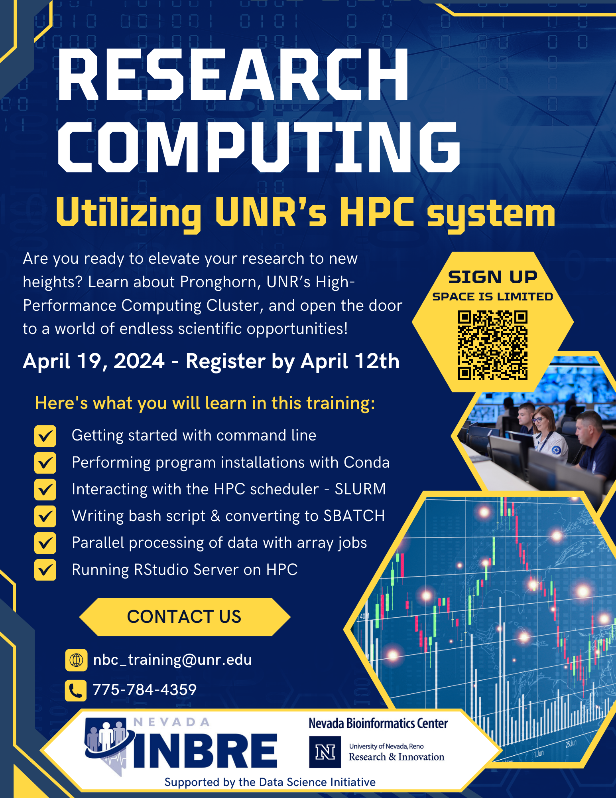

<!-- [Flyer](research_day_pdf.html) -->

Interested in learning about Research Computing?  
Ever wondered how advanced high performance computing can transform your academic and research pursuits? 
Want to learn how to take advantage of local resources? 

... then sign up for our **upcoming training event in April. ** 
 

Discover the power of Pronghorn, the cutting-edge HPC system on UNR's campus that could supercharge your research experience. Join us to embark on your journey from novice to HPC user in no time!

By the end of the workshop, you’ll master the installations of programs using Conda, conquer the HPC scheduler (SLURM) like a pro, write simple bash scripts and converting them to SBATCH submission scripts or SBATCH array scripts to allow for parallel processing. You will also learn how to run R Studio Server and Jupyter Notebook Server to keep using the analysis frameworks you are used to, but also leverage the computing power on our HPC!

Don't miss out on this opportunity to level up your HPC skills. 

 

## Workshop Overview

### Mastering Command-Line Basics & UNIX Fundamentals

During the morning session, we will ensure everyone is configured and can successfully access Pronghorn. We'll also delve into the discussion of local computing resources and the group's interest in Research Computing. Afterwards, our focus will shift towards mastering the UNIX file structure. We'll cover all the fundamental commands required to efficiently navigate, interact with, and manipulate files.

### Creating Analysis Scripts & Navigating the SLURM Job Scheduler

In the afternoon session, our attention will be on interacting with the SLURM job scheduler. The agenda includes hands-on activities starting by testing an analysis on a compute node, followed by scripting for automated analysis execution, and conversion of the script into an SBATCH script for running the analysis on Pronghorn. We will cover the process of transferring files to and from Pronghorn. Additionally, we will learn how to run R Studio Server and Jupyter Notebook Server to leverage HPC resources for your analyses.

 

## Things to Know

### Where
This is an in-person training event to be held on UNR's main campus; room information will be shared with accepted applications. 

### Who
The workshop’s intended audience are graduate students, but everyone interested in utilizing HPC is welcome to participate. **No prior programming or HPC experience is required.**

### When

All day Friday 4/19/24.

 
<table class="tg">
<thead>
  <tr>
    <th>Module</th>
    <th>Time</th>
  </tr>
</thead>
<tbody>
  <tr>
    <td>Mastering Command-Line Basics & UNIX Fundamentals </td>
    <td>8:30am – 11:30pm</td>
  </tr>
  <tr>
    <td>Creating Analysis Scripts & Navigating the SLURM Job Scheduler</td>
    <td>12:30pm – 4:30pm</td>
  </tr>

</tbody>
</table>
 

### Interested
Space is limited, registration is due by **April 12th, 2024**. Late application might be considered if space is available.

<a href="https://nvideaoffice.formstack.com/forms/researchcomputing">Click HERE to register for the Workshop</a> 

 #FFD844

In addition to the registration you need to onboard with UNR's HPC pronghorn system. 

<a href="https://nevada.formstack.com/forms/high_performance_computing_application">Click HERE to complete HPC's Onboarding Form</a> 

 

Questions?? Reach out at any time, email nbc_training@unr.edu or call (775) 784-4359.

### Flier

### Presenters

- Hans Vasquez-Gross, PhD - Nevada Bioinformatics Center
- John Anderson - OIT Research Computing

### Acknowlegement
This event is part of the Data Science Initiative and made possible by a grant from the National Institute of General Medical Sciences (GM103440) from the National Institutes of Health.

